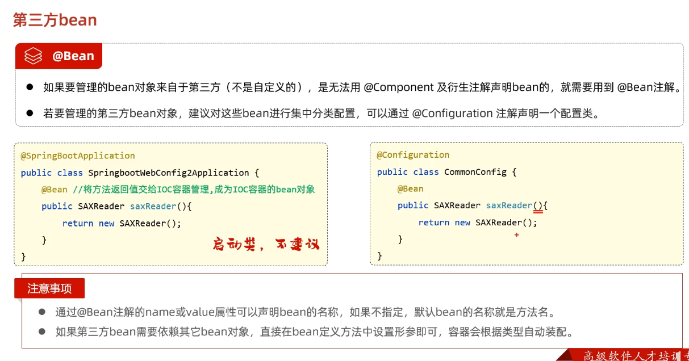

## 配置优先级

* 介绍

  1. 有SpringBoot有三种配置文件 其优先级 application > yml > yaml

     

  2. 项目通过java系统属性和命令行参数 配置 

     > 命令行参数优先级高于java系统属性 配置

     

  3. 总参数配置优先级

     

## Bean管理

* 获取bean

  1. 介绍

     通过ApplicationContext对象获取IOC容器中的bean对象

     > IOC容器中默认bean对象为单例的 只有一个

     

* bean作用域

  1. 介绍(五种作用域)

     

  2. 详解

     > @Lazy 注解在bean对象类上会延迟对象初始化 直到使用时候再初始化 不然默认单例作用域下 SpringBoot开始运行时就实例化交给IOC容器
     >
     > @Scope() 注解在bean对象类上来控制使用bean对象时是生成单例对象还是多例对象(单例作用域还是非单例作用域)
     >
     > ​	@Scope(“protorype”) -- 非单例作用域
     >
     > ​	@Scope("singleton") -- 单例作用域(默认)  - 可用@Lazy 延迟初始化

  3. 注意事项

     

* 第三方bean

  > 因为第三方jar包中的文件不可修改 不能使用@Component将第三方的bean交给IOC容器管理 这时可以使用@Bean将第三方Bean引入IOC容器  例如解析XLM文件的Dom4j依赖
  >
  > @Configuration声明的配置类也会注册到ioc容器 其中@Bean声明的方法的返回对象也会交给ioc容器 但同样需要组件扫描 如果组件扫描不到 则无法注册到ioc容器

  1. Dom4j依赖
  
     ```xml
      <!--Dom4j-->
             <dependency>
                 <groupId>org.dom4j</groupId>
                 <artifactId>dom4j</artifactId>
                 <version>2.1.3</version>
             </dependency>
     ```

  2. java第三方bean引入
  
     ```java
     //配置类
     @Configuration
     public class CommonConfig {
         @Bean
         //将当前方法的返回值对象交给IOC容器 成为IOC容器bean
         //1. 通过过@Bean交给IOC容器的对象名默认为方法名
         //2. 可以通过@Bean注解的name或value属性声明bean的名称
         //3. 配置第三方bean需要依赖其他bean对象可以直接在bean定义方法中设置形参即可 容器会根据类型自动装配
         public SAXReader sexReader(DeptService deptService) {
             System.out.println(deptService);
             return new SAXReader();
         }
     }
     //spring项目启动是 通过@Commentscan扫描器 会先加载其下通过@Comment注解声明的IOC容器对象 然后加载配置类中的@Bean声明的方法 会根据类型装配该方法参数中的Bean 该方法就可以使用bean对象 该方法返回的对象会加入IOC容器 实现第三方依赖中的bean成功交给ioc容器管理
     ```

  3. 总结
  
     

## SpringBoot原理

### 思想概况

> Spring是世界上最流行的java框架 它可以帮助我们更快 更容易的构建java项目  Spring家族中提供了很多优秀的java框架 所有 的框架都基于一个基础的框架SpringFramewrok(spring框架)  4.0spring框架后 通过简化依赖配置等 诞生了SpringBoot框架
>
> springBoot框架底层提供了两个非常重要的功能 - 起步依赖 自动配置

### 起步依赖

* 起步依赖原理

  > 通过依赖传递简化依赖配置 实现起步依赖单一配置  配置简单易行

### 自动配置

* 自动配置

  1. SpringBoot 的自动配置就是当spring容器启动后 一些配置类、bean对象就自动存入到了IOC容器中 不需要我们手动去声明 从而简化了开发 省去了繁琐的配置操作 这就是自动配置

* 自动配置原理

  1. 方案1

     > 组件扫描到jar包中的bean才能交个ioc容器  所以可以通过@CommentScan("包名")来主动声明扫描组件

     

  2. 方案2

     

     > 通过i@import直接导入类 配置类 或者接口 使其成ioc容器对象  import引入的类不需要组件扫描到 可以直接交给ico容器
     >
     > 导入普通类 该类交给IOC容器
     >
     > ```java
     > //普通类
     > ```
     >
     > 导入配置 配置类会交给ioc容器 根据原理 其中@Bean注解声明的方法的返回值对象也会交给ioc容器
     >
     > ```java
     > @Configuration
     > public class CommonConfig {
     >     @Bean
     >     //将当前方法的返回值对象交给IOC容器 成为IOC容器bean
     >     //1. 通过过@Bean交给IOC容器的对象名默认为方法名
     >     //2. 可以通过@Bean注解的name或value属性声明bean的名称
     >     //3. 第三方bean需要依赖其他bean对象可以直接在bean定义方法中设置形参即可 容器会根据类型自动装配
     >     public SAXReader sexReader(DeptService deptService) {
     >         System.out.println(deptService);
     >         return new SAXReader();
     >     }
     > }
     > ```
     >
     > 导入ImportSelector接口的实现类 接口中特定方法返回的String数组中的全类名对应的类都交给IOC容器 (相当于引入全类名数组 全部@import导入)
     >
     > ```java
     > public class MyImportSelector implements ImportSelector {
     >     @Override
     >     public String[] selectImports(AnnotationMetadata importingClassMetadata) {
     >         //该类交给IOC容器 可以指定多个
     >         return new String[]{"com.example.HeaderConfig"};
     >     }
     > }
     > ```
     >
     > 导入代码
     >
     > ```java
     > //@Import(Integer.class) //普通类
     > //@Import(CommonConfig.class)  // 配置类
     > //@Import(MyImportSelector.class) //对应接口实现类
     > 
     > @SpringBootApplication
     > public class SpringbootWebConfig2Application {
     > 
     >     public static void main(String[] args) {
     >         SpringApplication.run(SpringbootWebConfig2Application.class, args);
     >     }
     > 
     > }
     > ```
     >
     > **思路优化**  -- 注解封装
     >
     > 需要导入的jar包中定义一个接口注解@Enablexxx  该注解中封装@Import注解将应交给ioc容器的类都定义到这个注解中 在使用时就可以使用该注解直接简化@import配置 **该思路加上配置类导入就是springboot自动配置原理**
     >
     > 1. 封装
     > 2. 使用

* 底层自动配置原理

  > 文件中配置配类全类名  配置类中配置需要交给Ioc容器的bean
  >
  > AuotConfiguartionImportSelector类中String[] 字符串数组读取这些全类名 进行@import引入 这样就实现了自动装配
  >
  > 并不是所有的配置类中的bean对象都会交给IOC容器 而是有一定条件

  

* 条件装配

  

  详细

  

* 案例

  1. 自定义starter

     

  2. 思路

     

  3. 详细思路

     > 要想实现第三方依赖自动配置 可以直接进行依赖注入 尤其是自定义的工具类的依赖注入 可以使用以下方法
     >
     > 1. 定义起步依赖 新建模块 该模块用于依赖管理 其中只引入自动配置依赖模块 只保留pom配置文件
     >
     > 2. 定义自动配置依赖模块 该模块用于自动依赖配置 将工具类自动交给IOC容器
     >
     > 3. 自动配置依赖项目代码中加入需要自动依赖注入的配置类 (该配置类中用@Bean声明方法 返回交给ico对象的bean 如果需要自动配置多个依赖 这样较为简单 最终只需将一个配置类名写入加载配置文件中即可 )
     >
     >    
     >
     > 4. 自动配置依赖项目资源中加入sping底层识别的特殊文件 该文件记录的配类会加入 AuotConfiguartionImportSelector类中的String[] 字符串数组 进行@import引入加入ioc容器
     >
     >    
     >
     >    ```imports
     >    //特殊文件
     >    org.springframework.boot.autoconfigure.AutoConfiguration.imports
     >    ```
     >
     > 5. 以下为关于工具类的配置信息的配置 
     >
     > 6. @ConfigurationProperties(prefix = "aliyun.oss") 用于从配置文件中或取配置信息 赋值给配置信息类中的成员属性 使用该注解时该类必须交给IOC容器(可以用@Compont或其衍生注解 但在此因为是第三方依赖包 不指定扫描器扫描是不会生效的 故用其他方法) 
     >
     > 7. @EnableConfigurationProperties(AliOSSProperties.class) 该注解只能用于配置类或者@Bean标明的方法上 用于将指定配置类交给IOC容器  这里的意思为  @EnableConfigurationProperties 注解的作用是将使用 @ConfigurationProperties 注解的类注册到 IOC 容器中 其与@Component有些许不同
     >
     > 8. 工具配置类中使用@Bean引入工具类到ioc容器  (通过AuotConfiguartionImportSelector类中的String[] 字符串数组 进行@import引入加入ioc容器)
     >
     > 9. @Bean声明的方法中可以直接声明IOC对象进行依赖注入 从而获取工具配置类 得到配置信息
     >
     > 10. 当Springboot项目运行时 因为引入自定义起步依赖 根据依赖传递 传递了相关的功能依赖 较简便 并且自动配置依赖中的org.springframework.boot.autoconfigure.AutoConfiguration.imports文件会被读取放到总的自动配置文件中去  通过传递到AuotConfiguartionImportSelector类中的String[] 字符串数组 各个配置类进行@import引入 根据条件装配筛选后 配置类中的@Bean声明的方法返回的对象就可以加入ioc容器 在项目中就可使用@Autowired进行依赖注解 


## 总结


> 1. web后端开发基本上都是基于标准的三层架构开发的
> 2. controller控制器层负责接收请求响应数据
> 3. Service业务层负责具体的业务逻辑处理
> 4. dao数据访问层(持久层)用来处理数据访问操作的 来完成数据库中的增删改查操作
> 5. 在执行具体的业务处理之前需要执行一些通用的 业务处理 可以借助javaweb三大组件中的过滤器  或者spring中提供的拦截器
> 6. 为了实现三层架构之间的解耦 需要使用ioc(控制反转) di(依赖注入)
> 7. 控制反转就是将对象创建的控制权由应用程序自身交给外部容器(IOC/spring容器) 声明为Spring容器中的bean对象
> 8. 依赖注入指容器为程序提供运行时所需要的资源(对象)
> 9. AOP 面向切面编程   事物管理  全局异常处理  会话跟踪技术cookie session jwt  对象存储服务阿里云oss 持久层框架Mybatis
> 10. spring框架中web开发模块提供了很多功能 如全局异常处理器 拦截器
> 11. spring框架中的 web开发模块也被称为SpringMVC框架
> 12. SpringMvc不是一个单独的框架 而是spring框架的一部分 是用来简化原始的Service程序开发的 

* spring framework Springboot Springmvc mybatis介绍

  > 1. Spring Framework 是一个综合性的应用程序开发框架，提供了许多功能模块，包括依赖注入（Dependency Injection）、面向切面编程（Aspect-Oriented Programming）、事务管理、数据访问、安全等。Spring Framework 提供了一个容器，用于管理对象的生命周期和依赖关系，使开发人员能够更方便地构建应用程序。
  > 2. Spring Boot 是一个用于简化Spring应用程序开发的框架。它提供了一个自动化的配置和快速启动的机制，可以减少开发人员的配置工作并提供了一套约定优于配置的开发模式。Spring Boot 可以集成Spring MVC、Spring Framework和MyBatis等框架，使整个应用程序开发过程更加简化和高效。
  > 3. Spring MVC 是基于Spring Framework的Web框架，用于开发基于MVC（Model-View-Controller）架构的Web应用程序。它提供了处理请求、路由、视图渲染等功能，使开发人员能够更轻松地构建Web应用程序。
  > 4. MyBatis 是一个持久层框架，用于简化数据库访问的过程。它提供了一种简单的方式来执行SQL查询、插入、更新和删除操作，并支持对象关系映射（ORM）功能。MyBatis 可以与 Spring MVC 或其他框架集成，以便更好地处理数据库操作。

* spring framework Springboot Springmvc mybatis联系

  > 1. Spring MVC 是 Spring Framework 的一部分，它是 Spring Framework 中的一个模块，用于构建基于 MVC 架构的 Web 应用程序。因此，Spring MVC 包含在 Spring Framework 中。
  > 2. MyBatis 是一个独立的持久层框架，它并不是 Spring Framework 的一部分。然而，MyBatis 可以与 Spring Framework 无缝集成，利用 Spring 的依赖注入和事务管理等功能来优化数据库访问的处理。因此，虽然 MyBatis 不是 Spring Framework 的一部分，但它可以与 Spring Framework 结合使用。
  > 3. Spring Boot 是基于 Spring Framework 构建的框架，它提供了自动化的配置和快速启动的机制，以简化 Spring 应用程序的开发和部署。Spring Boot 可以集成 Spring MVC、Spring Framework 和 MyBatis 等框架，因此 Spring Boot 包含了 Spring MVC、Spring Framework 和 MyBatis。
  >
  > 综上所述，可以说 Spring Framework 是一个更大的框架，而 Spring MVC、MyBatis 和 Spring Boot 则是 Spring Framework 中的子模块或扩展。同时，Spring Boot 可以集成 Spring MVC 和 MyBatis，使得开发更加便捷。

  总的来说  springboot包含springframework 包含springmvc 

  并且springboot可以集成mybatis
