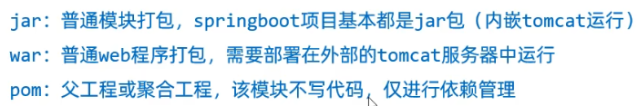
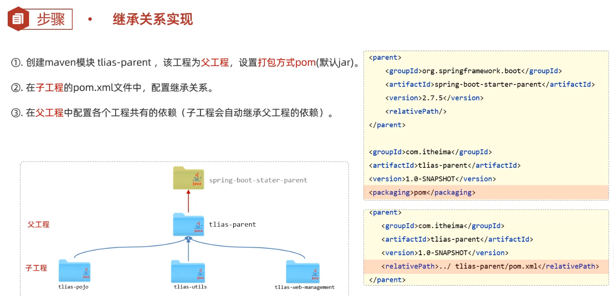
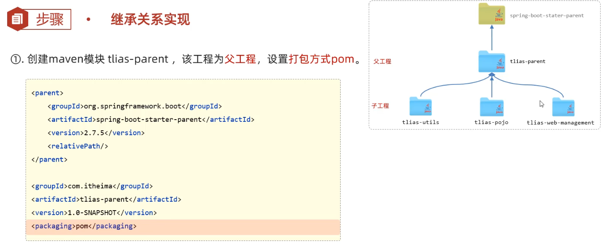
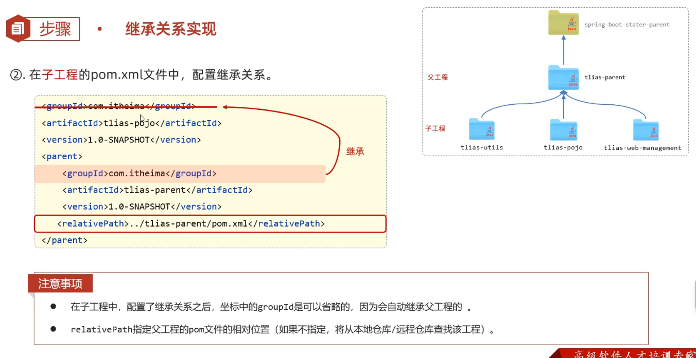

### 分模块设计与开发

* 介绍

  

* 实践

  > 导入的模块包名与启动类相同的包，下面的@Component会被组件扫描到  猜测:
  >
  > 引入的所有jar包都根据其内容加入到java包下 只是不可见 相同的包名会定义成放在同一个包下(一般为com.xxx.xxx) 所以组件扫描可以扫描到
  >
  > 当启动类的组件扫描不到时 其他包中的依赖根据spring底层可以自动装配  (文件中配置配类全类名 配置类中配置需要交给Ioc容器的bean 
  >
  > AuotConfiguartionImportSelector类中String[] 字符串数组读取这些全类名 进行@import引入 这样就实现了自动装配)
  >
  > 所以如果包名不相同 而且没有进行自动装配配置 (自定义起步依赖)  引入后因为组件扫描不到 会造成无法应用控制反转 使用依赖注入

  

* 总结

  

### 继承与聚合

#### 继承

* 基本介绍

  1. 继承可以减少依赖重复配置

  2. 继承是用来描述两个工程之间的关系

  3. 常见于依赖关系继承

  4. maven中项目的继承为单继承机制 但可以多重继承

     

* 继承关系

  1. 常见打包方式

     

  2. 实现

     > 父工程一般打包方式为Pom
   >
     > ```xml
     >     <!--    父类工程-->
     >     <parent>
     >         <groupId>org.springframework.boot</groupId>
     >         <artifactId>spring-boot-starter-parent</artifactId>
     >         <version>2.7.16</version>
     >         <relativePath/> <!-- lookup parent from repository   该标签指定父工程的pom文件位置 相对路径从pom文件开始找 找到pom文件继承依赖 如果不指定 就直接到本地仓库中寻找 springboot项目的默认父工程都为默认到仓库寻找 -->
     > 常见的有    <relativePath>../项目名/pom.xml<relativePath/>
     > 
     > </parent>
     > 
     > <groupID> </groupID>
     > <artifactID>  </artifactID>
     > <version>  </version>
     > <packaging> pom </packaging>
     > ```
  
     

  3. 步骤

     1. 提取父工程依赖 放入父工程 指定打包方式为pom  新工程通过<partent> 继承父工程(坐标 pom文件相对路径)

        

     2. 父模块和子模块的 groupId 必须保持一致，否则 Maven 无法正确识别父子关系。另外，父模块和子模块需要在同一目录下或者符合 Maven 的多模块项目结构。

        

     3. 配置父类工程公有依赖

        

  4. 小结

     

* 版本锁定

  1. 在父工程中可以通过<dependencyManagement> 来统一管理依赖版本 在子工程中引入依赖时 就不用加版本 利于版本统一 (注意 父工程使用该标签中引入的依赖并不会直接加入父工程 只是进行依赖版本统一配置)

     

  2. 自定义属性/引用属性

     通过自定义属性可以集中的维护依赖的版本号 通过在<popperties>标签中定义依赖版本属性(一般是在父工程中定义)   指定依赖版本时 通过${} 引用对应的版本值  配合 <dependencyManagement>  版本锁定 非常方便

     

  3. 小结

     


#### 聚合 

* 基本介绍
  1. 基本maven的生命周期指令 分模块打包很麻烦 需要将依赖的模块以及父工程安装到仓库 然后才能打包
  2. 
* 实现
  1. 在空工程的pom文件中(一般是父类工程)使用<modules> 实现聚合其他模块 在该工程中执行maven指令  会根据模块依赖关系按顺序操作所有指定模块  包括统一打包 安装 清理 发布 等 这称之为聚合
  2. 

### 聚合和继承联系


### 私服

* 介绍

  1. 当两个项目组想要互相分享开发的jar包 但不能通过中央仓库共享 一对一传到本地仓库又太麻烦 这时可以使用私服 私服有着远程仓库的功能  这样就可以根据坐标共享jar包(如工具类)

  2. 有了私服下载jar包依赖的关系就是 先找本地仓库 本地仓库没有到私服找 私服没有 私服会自动从中央仓库下载 基本图解

     

* 资源上传和下载

  资源上传

  1. 操作 在maven中配置访问私服的用户名和密码<servers> 

     

  2. 在项目中指定上传资源的位置(URL地址)

     

  资源下载

  1. 在maven中配置连接私服仓库组的地址<mirrors>

     

     仓库组地址是指下载依赖时可以从私服中任意仓库下载 而不是特定的某一仓库

  2. 在maven中指定仓库组地址的配置信息<profile>

     

  示意图

  

  私服中central仓库为从中央仓库下载的依赖  release仓库 和 snapshot仓库存放依赖规则如下

  自开发的jar包默认版本号都为xxx-SNAPSHOT 发布时会默认存储到snapshot仓库中 除此之外的版本号发布时都会存储到RELEASE仓库中

  

  

### 大总结


