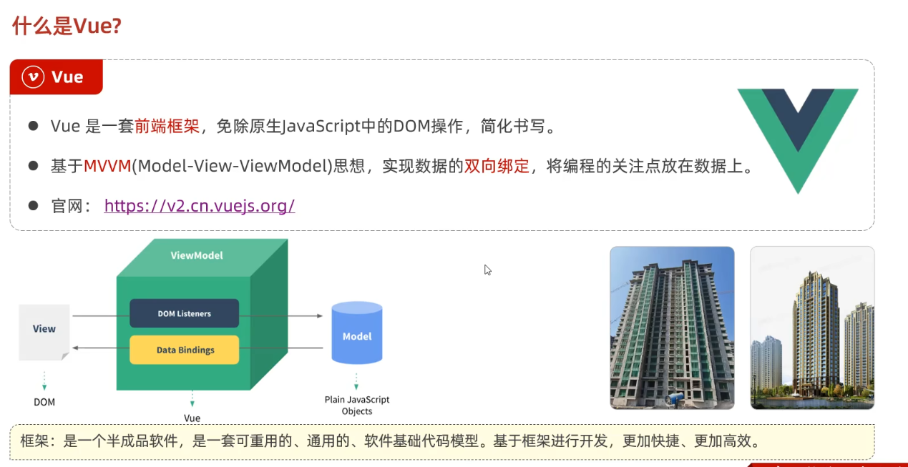
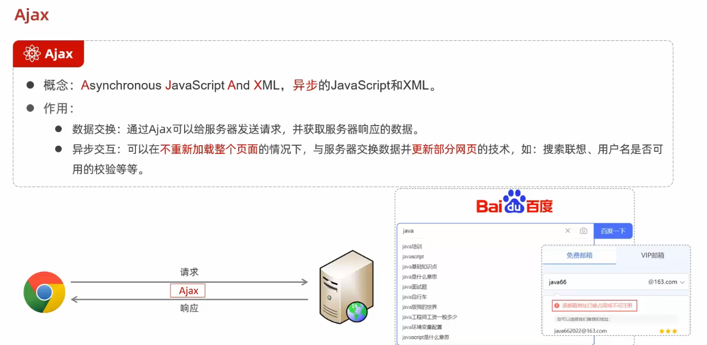

### 课程安排 

**了解即可**

* Web标准

  1. html 负责网页的结构 (页面元素和内容)
  2. css 负责网页的表现 (页面元素的外观 位置等页面样式 如 颜色 大小等)
  3. javaScript  负责网页的行为 (交互效果)

* Web前端开发技术栈

  

### HTML  CSS

* HTML CSS基本介绍

  

* HTML快速入门

  ```html
  // 创建html文件
  <html>
      <head>
          <title>Hello HTML</title>
      </head>
      <body>
          <h1>
              Hello World
          </h1>
          
      </body>
  </html>
  // html特点:
  // html标签不区分大小写
  // html标签属性可以用单引号 可以使用双引号
  // html语法松散
  ```

  

* VS CODE开发工具

  pass

  * 基础标签 样式

  * 新浪新闻 标题

    1. 标题排版

       

       代码

       ```html
       <!DOCTYPE html>
       <html lang="en">
       <head>
           <meta charset="UTF-8">
           <meta name="viewport" content="width=device-width, initial-scale=1.0">
           <title>Document</title>
           <link rel="stylesheet" href="css/news.css">
       </head>
       <body>
            <a href="http://gov.sina.com.cn/" target="_blank">新浪政务</a> > 新闻
           <h1>焦点访谈：中国底气 新思想夯实大国粮仓</h1>
           <hr>
           <span class="cls">2023年03月02日 21:50 </span>  <a href="#">央视网</a>
           <hr>
       </body>
       </html> 
       ```

    2. 标题样式

       样式格式

       

       ```css
       h1 {
           color: #505155;
       }
       .cls {
           color: #adbad1;
           font-size: 13px;
       }
       a {
           color: black;
           text-decoration: none;
       }
       ```

  * 新浪新闻 正文

    1. 正文排版

       

       ```html
       <!DOCTYPE html>
       <html lang="en">
       <head>
           <meta charset="UTF-8">
           <meta name="viewport" content="width=device-width, initial-scale=1.0">
           <title>Document</title>
           <link rel="stylesheet" href="css/news.css">
       </head>
       <body>
           <div>
                <a href="http://gov.sina.com.cn/" target="_blank">新浪政务</a> > 新闻
               <h1>焦点访谈：中国底气 新思想夯实大国粮仓</h1>
               <hr>
               <span class="cls">2023年03月02日 21:50 </span>  <a href="#">央视网</a>
               <hr>
       
               <!-- 正文 -->
               <video src="#" controls="controls" width="950"></video>
               <audio src="#" controls="controls" ></audio>
       
               <p><b>文字</b>字文字文字文字文字文字文字文字文字文字文字文字文字文字文字文字文字
                   文字文字文字文字文字文字文字文字文字文字文字</p>
               <p>文字文字文字文字文字文字文字文字文字文字文字</p>
               <p class="plast">责任编辑</p>
           </body>
          </div>
       </html> 
       ```

       css 

       ```css
       h1 {
           color: #505155;
       }
       .cls {
           color: #adbad1;
           font-size: 13px;
       }
       a {
           color: black;
           text-decoration: none;
       }
       p {
           text-indent: 20px;
           line-height: 20px;
       }
       .plast {
           text-align: right;
       }
       ```

       

    2. 页面布局

       

       ```css
       # div盒子样式
       div {
           width:200px;
           height：200px;
           box-sizing:border-box; 
           //一般设置div盒子的内外边距为0  不设置该属性 设置的长和宽为content的值 这样内容content就会塞满整个盒子(撑大) 当想要使用内边距时 内边距会继续撑大盒子 需要注意这一特性来编写 
           如果加上 box-sizing:border-box;设置的就是盒子的固定大小 设置内边距就会压缩内容content的大小 从而保持盒子的固定大小
           padding 20px;
           border: 10px solid red;
       border的边框线是内部的 会撑大盒子 / 减小内容盒子大小
           margin: 30px;
       }
       ```

       css

       ```css
       .center {
           width: 65%;
           margin: 0 auto;
       }
       ```

* 表格 表单标签

  1. 表格

     

  2. 表单标签

     

     表单项

### JavaScrpt

* js引入方式

  ```javascript
  有两种
  1.  <!-- 内部脚本 script 标签可以出现多次 可以出现任何位置 -->
  <script>
      alert("hello js")
  </script>
  2. <!-- 外部脚本 -->
  <script src="js/02_.js学习.js"></script>
  
  
  js代码 
  alter("hello js")
  ```

* js基础语法

  1. 书写语法

     ```javascript
     <!-- 基础语法 -->
     特点:
     1. 区分大小写   
     2. js代码每行结尾分号可有可无 但尽量加  
     3. 注释 : 单行 //  多行 /**/  ctrl shift + /
     4. 大括号表示代码块 {}
     
     <!-- 输出语法 -->
     window.alter()  弹出警告框
     document.write() 写入html页面中
     console.log() 控制台输出
     ```

  2. 变量

     ```javascript
     <!-- 基础语法 -->
     1. var(variable的缩写)来声明变量
     2. js是一门弱类型语言 变量可以存储不同类型的值 如
     var a  = "a";
     var a = 1;
     3. 变量字母数字下划线$命名 不能以数字开头
     
     <!-- 特点 -->
     特点1 var定义的变量作用域比较大 是属于全局变量
     特点2 var定义的变量 是可以重复定义的 重复定义覆盖 如  var 
     var a  = "a";
     var a = 1;
     
     <!-- 其他定义方式 -->
     let  声明的变量只在代码块内有效 且不允许重复声明 为局部变量
     const 声明一个只读的常量 声明后常量的值就不能改变
     
     <!-- 总结 -->
     var 定义的变量是可以重复定义的全局变量
     let 定义的变量是不可重复定义的局部变量
     const 定义的变量是不可修改 不可重复的定义的常量
     ```

  3. 数据类型 运算符  类型转换 流程控制语句

     ```javascript
     <!-- 原始数据类型  --> 五种
     number : 整数 小数 NaN (Not a Number) 
     string : 字符串 单双引号都行
     boolean 布尔 true false
     null 对象为空  null类型为Object  因为null是对象的占位符
     undefined  当声明的变量未初始化时 改变量的默认值为 undefined
     typeof 变量名  获取变量的数据类型
     
     <!-- 运算符 -->
     == 比较时会进行类型转换
     === 全等运算符 不会进行类型转换
     var a = 10;
     a == "10" true
     a === "100" false
     a === 10 true
     其余正常
     
     <!-- 类型转换 --> 两种
     1. 字符类型转换成数字
     用parseInt()转换  如果不是数字会换成NaN  优先转换前面的字符 如果第一个字符不是数字 就转换成 NuN
     
     2. 其他类型转换成布尔类型
     Number: 0 和 NuN转换成false 其他为true
     String: 空字符串转换成false 其他为true
     Null 和 undefined转换成false
     
     <!-- 流程控制 -->
     if else
     switch
     for
     while
     do while
     同java
     ```

* js函数

  ```javascript
  定义方式1:
  function 函数名(参数) {
      代码体;
  }
  定义方式2
  var 函数名 = function(参数) { }
  
  定义方式3 匿名函数
  function(参数) {}
  
  定义方式4 箭头函数
  (参数) => {}
  
  说明:
  形参不需要类型
  返回值不需要类型
  
  调用:
  函数名(实参)
  ```

* js对象

  1. 基础对象

     ```javascript
     ------------# 1. 数组Array ------------
     定义方式1 
     var 变量名 = new Array(元素列表)
     定义方式2
     var 变量名 = [元素列表]
     访问:
     arr[索引]
     
     特点:
     数组长度可变 未定义的数组元素为undefined
     数组类型可变
     
     属性和方法
     属性:
     length 数组长度数量
     方法:
     forEach() 遍历数组中每个有值的元素 并调用一次传入的函数
     push()  将新元素添加到数组的末尾 并返回新的长度
     splice(删除索引位置,删除元素数量) 从数组中删除元素
     
     ----------# 2. 字符串String ------------
     创建方式
     var 变量名 = new String()
     var 变量名 = ""
     
     属性:
     length  字符串的长度
     方法:
     charAt()  返回在指定位置的字符
     indexOf()  检索字符串
     trim() 去除字符串两侧的空格
     substring(start,end)  提取字符串中两个指定的索引之间的字符 前闭后开
     ----------# 3. 自定义对象 ------------
     定义格式1
     var 对象名 = {
         属性1: 属性1,
         属性2: 属性2,
         属性3: 属性3,
         属性4: 属性4,
         函数名称: function(形参) {
     
         }
     }
     定义格式2
     var 对象名 = {
         属性1: 属性1,
         属性2: 属性2,
         属性3: 属性3,
         属性4: 属性4,
         函数名称:(形参) {
     
         }
     }
     调用:
     对象名.属性名;
     对象名.函数名();
     
     ----------# 4. Json对象 ------------
     JSON - javaScript Object Notation -- javaScript对象标记法
     json文件 就是 javaScript对象标记法书写的文本
     由于其语法简单  多用于数据载体  在网络中进行传输
     定义
     var 变量 = '{"key1":value}'
     value 根据情况不同来确定
     1 数字 (直接写数字或浮点数)
     2 字符串 (在双引号中书写)
     3 逻辑值 (直接写true或false)
     4 数组 (在方括号中)
     5 对象 (在花括号中)
     6 null (直接写null)
     
     JSON字符串转换成JSON对象
     var jsObject = JSON.parse(json字符串)
     JSON对象转换成JSON字符串
     var jsStr = JSON.stringify(json对象)
     
     访问 jsObject.key  得到属性
     ```

  2. BOM

     ```html
     # Bom - Browser Object Model 浏览器对象模型 允许JavaScript与浏览器对话
     JavaScript将浏览器的各个组成部分封装成对象
     
     # 封装的对象有
      1. Window 浏览器窗口对象
          2. Navigator 浏览器对象
          3. History 历史记录对象
          4. Location 地址栏对象
      4. Screen 屏幕对象
     
     
     Window窗口对象
     获取对象:
     直接使用window 其中window可以省略
     属性:
     history 历史记录对象
     location 地址栏对象
     navigator 浏览器窗口对象
     方法:
     alter() 显示一段消息和一个确认按钮的警告框
     confirm() 显示带有一段消息以及确认按钮的对话框 返回值为布尔
     setInterval(函数,周期) 按指定的周期(毫秒计算) 来调用函数或表达式 执行多次
     setTimeout() 在指定毫秒调用函数或计算表达式  执行一次
     
     地址栏对象
     获取对象:
     window.location 
     属性:
     href 设置或返回完整的url 然后进入新的域名
     ```

     

  3. DOM

     ```html
     Document Object v-model 文档对象模型
     将标记语言的各个组成部分封装成对应的对象
     
     1. Document 整个文档对象
         2. Element 元素对象
         3. Attribute 属性对象
         4. Text 文本对象
         5. Comment 注释对象
     
     四种获取元素对象的方法
     1. 根据id
     2. 根据标签名
     3. 根据name属性值
     4. 根据class
     
     然后根据对象修改属性或调用方法
     ```

     

* js事件监听

  1. 事件绑定

     ```html
     方式1
     通过html标签中的事件进行绑定
     <input type="button" onclick="on()" value="按钮1">
     <script>function on() {
         alter("点击按钮")
     }
     </script>
     方式2
     通过DOM元素属性绑定
     <input type="button" id="btn" value="按钮1">
     <script>{
     document.getElementById('btn').onclick=function(){
         alter("点击按钮")
     }
             //通过js设置文档对象的属性值  相当于直接设置
     }
     ```
  
     
  
  2. 常见事件
  
     
  
     
  
  3. 案例
  
     设置事件 触发函数  函数中获取DOM对象 操作标签对象来实现目的
  

### Vue

* 什么是Vue -- (js库 一个 js文件)

  

* Vue快速入门

  ```html
  <!DOCTYPE html>
  <html lang="en">
  
  <head>
      <meta charset="UTF-8">
      <meta name="viewport" content="width=device-width, initial-scale=1.0">
      <title>Document</title>
      <script src="js/vue.js"> // 1 引入vue文件
      </script>
  </head>
  
  <body>
      <!-- 3 编写视图层的展示 -->
      <div id="app">
          <input type="text" v-model="message">
          {{message}}  
          <!-- 插值表达式 内容可以是 变量 三元运算符 函数调用 算数运算-->
      </div>
  </body>
  <script>
      // 2 定义Vue对象
      new new Vue({
          el: "#app", //vue接管区域
          data: { //数据模型
              message: "hello vue" 
          }
      })
  </script>
  
  </html>
  ```

* vue的常用指令

  

  ```html
  
  <!DOCTYPE html>
  <html lang="en">
  
  <head>
      <meta charset="UTF-8">
      <meta name="viewport" content="width=device-width, initial-scale=1.0">
      <title>Document</title>
      <script src="js/vue.js">
          // 1 引入vue文件
      </script>
  </head>
  
  <body>
      <!-- 3 编写视图层的展示 -->
      <div id="app">
          零 <input type="text" v-model="message">
          {{message}}
          <!-- 插值表达式 内容可以是 变量 三元运算符 函数调用 算数运算-->
          <br><br>
          一 <!-- v-bind的使用 为HTML标签绑定属性值 如设置href,css样式等 -->
          <a v-bind:href="url">百度1</a>
          <a :href="url">百度2</a>
          <br><br>
          二 <!-- v-model的使用 在表单元上创建双向数据绑定 v-bind 和 v-model绑定的变量 必须在数据模型中声明 -->
          <input type="text" v-model="url">
          <br><br>
          三 <!-- v-on 的使用  v-on:事件 表示触发事件后调用对应的属性函数-->
          <input type="button" value="点我" v-on:click="handle()">
          <input type="button" value="点我" @click="handle()">
          <br><br>
          四 <!-- v-if else if else  v-show的使用  if是成立浏览器渲染 show是成立display展示 -->
          年龄<input type="text" v-model="age">
          <span v-if="age <=30" >年轻人</span>
          <span v-else-if="age <60" >中年</span>
          <span v-else>老年人</span>
          <span v-show="age>100">老老人</span>
          <br><br>
          五 <!-- v-for的使用  遍历列表得到数据和下标 -->
          <div v-for="(address,index) in address">
              {{address}},{{index}}
          </div>
      </div>
  
  </body>
  <script>
      // 2 定义Vue对象
      new new Vue({
          el: "#app", //vue接管区域
          data: {
              message: "hello vue",
              url: "https://www.baidu.com",
              age: 20,
              address:['1','2','3','4','5','6']
          },
          methods: {
              handle: function () {
                  alert("点了一下")
              }
          },
      })
  </script>
  ```

* Vue的生命周期

  

  

  ```htmll
  每个生命周期都有一个生命周期方法 钩子方法
  
  mounted() { //表示Vue挂载完成
  //生命周期(钩子)方法 到达该生命周期自动执行
  //通常 通过此方法发送请求到服务端 以获取服务端的数据
  alert("Vue挂载完成 发送请求到服务端")
  }
  ```

### Ajax（Axiox）

* 介绍及作用

  

  原生的Ajax获取服务端数据的方法

  1. 数据地址
  2. 创建XMLHttpRequest对象 用于和服务器交换数据
  3. 向服务器发送请求
  4. 获取服务器响应数据

  ```html
  <!DOCTYPE html>
  <html lang="en">
  <head>
      <meta charset="UTF-8">
      <meta name="viewport" content="width=device-width, initial-scale=1.0">
      <title>Document</title>
  </head>
  <body>
      <input type="button" value="获取数据" onclick="getData()">
      <div id="divl"></div>
  </body>
      <script>
          function getData() {
              //创建对象
              var XML = new XMLHttpRequest();
              //发送请求
              XML.open('GET','https://mock.apifox.cn/m1/3128855-0-default/emp/list');
              XML.send();
              //获取服务器对应数据
              XML.onreadystatechange = function() {
                  if(XML.readyState == 4 && XML.status == 200) {
                      document.getElementById('divl').innerHTML = XML.responseText;
                  }
              }
          }
      </script>
  </html>
  
  Get请求适用于获取数据、查询、搜索等操作，传递数据量较小且不敏感的情况下；而Post请求适用于提交数据、创建资源、传递大量数据或敏感信息的情况下。
  
  需要注意的是，Get请求的参数会附加在URL中，而Post请求的参数在请求体（body）中，所以对于传输大量数据或敏感信息，更推荐使用Post请求。
  
  ```

* Axios入门  基于ajax的封装

  1. 引用Axios的js文件

  2. 使用Axios发送异步请求 获取结果

     

  3. 代码

     ```html
     <!DOCTYPE html>
     <html lang="en">
     
     <head>
         <meta charset="UTF-8">
         <meta name="viewport" content="width=device-width, initial-scale=1.0">
         <title>Document</title>
         <!-- 1 引入Axios的js文件 -->
         <script src="js/axios-0.18.0.js"></script>
     </head>
     
     <body>
         <input type="button" value="get" onclick="get()">
         <input type="button" value="post" onclick="post()">
     
     </body>
     
     <script>
         function get() {
             //通过axios发送异步请求 -get
             axios({
                 method: "get",
                 url: "https://mock.apifox.cn/m1/3128855-0-default/emp/list"
             }).then((result) => {
                 console.log(result.data)
             })
             // //简化
             // axios.get("https://mock.apifox.cn/m1/3128855-0-default/emp/list").then((result) => {
             //     console.log(result.data)
             // })
     
             //通过axios发送异步请求 - post
         }
     
         function post() {
                 axios({
                     method: "post",
                     url: "https://mock.apifox.cn/m1/3128855-0-default/emp/deleteById",
                     data: "id=1"
                 }).then(result => {
                     console.log(result.data)
                 })
             }
             // //简化
             // axios.post("https://mock.apifox.cn/m1/3128855-0-default/emp/deleteById", "id=1").then((result) => {
             //     console.log(result.data)
             // })
     </script>
     
     </html>
     ```

* Axiox Vue的使用案例

  代码

  ```html
  <!DOCTYPE html>
  <html lang="en">
  
  <head>
      <meta charset="UTF-8">
      <meta name="viewport" content="width=device-width, initial-scale=1.0">
      <title>Document</title>
      <!-- 引入vue文件 - 基于DOM封装操作文档对象的框架
      引入Axios的js文件 - 基于Ajax封装的异步请求服务器数据技术 -->
      <script src="js/vue.js"></script>
      <script src="js/axios-0.18.0.js"></script>
  </head>
  
  <body>
      <div id="app">
          <table border="1" cellspacing="0" width="60%" align="center">
              <tr>
                  <th>编号</th>
                  <th>姓名</th>
                  <th>照片</th>
                  <th>性别</th>
                  <th>职务</th>
                  <th>入职时间</th>
                  <th>更新时间</th>
              </tr>
              <!-- //这里获取每一个emp对象 -->
              <tr v-for="(emp,index) in emps" align="center">
                  <!-- 插值表达式 -->
                  <td>{{index}}</td>
                  <td>{{emp.name}}</td>
                  <td>
                      
                  </td>
                  <td>
                      <span v-if="emp.gender == 1">男</span>
                      <span v-if="emp.gender == 2">女</span>
                  </td>
                  <td>{{emp.job}}</td>
                  <td>{{emp.entrydate}}</td>
                  <td>{{emp.updatetime}}</td>
              </tr>
          </table>
      </div>
  </body>
  <script>
      //使用Vue对象操作文档对象
      new new Vue({
          el: "#app", //接管区域
          data: { //数据对象
              emps: [], //数组
          },
          //钩子方法 自动加载执行
          mounted() {
              axios.get("https://mock.apifox.cn/m1/3128855-0-default/emp/list").then((result) => {
                  //result 封装了返回的结果 这里将结果中的data对象数组赋给数据对象emp
                  this.emps = result.data.data
              })
          },
      })
  </script>
  
  </html>
  ```

  理解

  Vue用于封装数据 通过MVVM的形式与文档对象数据保持一致  从而统一操作文档对象属性  当数据变化时 不用修改每一个文档对象的属性 只需要修改vue对象中的属性即可

  Axios用于服务器数据的异步获取 可以得到服务器数据 通过与vue结合 将服务数据保存到vue对象中 即可实现通过服务器数据操作网页数据的效果
  
  前端一般基于 使用vue框架 以及 axios技术实现前端显示交互以及数据获取操作

### Vue-cil 及 Nodejs

* 前后端分离开发

  * 介绍

    前后端分离开发较为主流  

    流程  需求分析  接口分析  前后端并行开发  测试  前后端联调测试

  * YAPI

    接口文档管理平台  aip管理平台

    添加项目  添加分类 添加接口 设置接口信息

    地址 ： http://yapi.smart-xwork.cn/

* 前端工程化

  * 实际前端开发

    

  * 前端工程化环境准备

    可以用Vue中的技术来使前端生成一个Vue项目模板 **Vue-cli**  是Vue官方提供的一个脚手架 可以快速生成一个Vue项目模板

    Vue-cli 依赖 NodeJs环境  安装完成Vue-cil和Nodejs后可以通过指令创建对应的 Vue项目模板

    > Vue脚手架（Vue CLI）需要Node.js的原因如下：
    >
    > 1. 运行环境：Vue脚手架是一个命令行工具，需要在命令行中执行。Node.js提供了一个运行时环境，使得我们可以在命令行中执行JavaScript代码。Vue脚手架的命令行工具是基于Node.js开发的，因此需要Node.js来提供运行环境。
    > 2. 包管理工具：Vue脚手架使用了Node.js的包管理工具NPM（Node Package Manager）。NPM是一个非常强大的包管理工具，用于管理JavaScript代码库中的依赖项和模块。Vue脚手架的预设模板和插件都依赖于NPM来下载和安装。因此，需要Node.js来提供NPM的运行环境。
    > 3. 构建工具：Vue脚手架使用了Webpack等构建工具来打包和构建项目。Webpack是一个基于Node.js的构建工具，用于处理模块依赖、打包代码、压缩文件等。Vue脚手架的开发服务器、热重载等功能都依赖于Webpack。因此，需要Node.js来提供Webpack的运行环境。

    

  * Vue项目简介

    目录结构介绍

    

    配置端口 该端口默认占用8000 如果冲突 可以手动修改
  
    
  
  * Vue项目开发流程
  
    

### Element

* 介绍

  Element是基于Vue 2.0开发的桌面组件库

  

* 快速入门

  
  
  代码
  
  ```html
  // https://element.eleme.cn/ 组件官网
  
  <template>
    <div>
      <el-row>
        <el-button>默认按钮</el-button>
        <el-button type="primary">主要按钮</el-button>
        <el-button type="success">成功按钮</el-button>
        <el-button type="info">信息按钮</el-button>
        <el-button type="warning">警告按钮</el-button>
        <el-button type="danger">危险按钮</el-button>
      </el-row>
    </div>
  </template>
  <script>
  export default {};
  </script>
  
  <style>
  </style>
  
  
  <template>
    <div>
    <element-view></element-view>
    </div>
  </template>
  <script>
  import ElementView from './views/element/ElementView.vue'
  export default {
    components: { ElementView },
    
  }
  </script>
  <style>
  
  </style>
  ```
  
* 常见组件 

  https://element.eleme.cn/ 组件官网
  
  1. table表格
  2. from表单
  3. pagination分页
  4. dialog对话框
  5. 页面基本布局
  
  ```vue
  <template>
    <div>
      <!-- 按钮组件 -->
      <el-row>
        <el-button>默认按钮</el-button>
        <el-button type="primary">主要按钮</el-button>
        <el-button type="success">成功按钮</el-button>
        <el-button type="info">信息按钮</el-button>
        <el-button type="warning">警告按钮</el-button>
        <el-button type="danger">危险按钮</el-button>
      </el-row>
      <br />
  
      <!-- 表格组件 -->
      <el-table :data="tableData" style="width: 100%">
        <el-table-column prop="date" label="日期" width="180"> </el-table-column>
        <el-table-column prop="name" label="姓名" width="180"> </el-table-column>
        <el-table-column prop="address" label="地址"> </el-table-column>
      </el-table>
      <br />
  
      <!-- 分页组件 -->
      <el-pagination
        background
        layout="total,sizes,prev, pager, next,jumper"
        :total="1000"
        @size-change="handleSizeChange"
        @current-change="handleCurrentChange"
      ></el-pagination>
  
      <!-- 对话框 -->
      <!-- Table -->
      <el-button type="text" @click="dialogTableVisible = true"
        >打开嵌套表格的 Dialog</el-button
      >
      <el-dialog title="收货地址" :visible.sync="dialogTableVisible">
        <el-table :data="gridData">
          <el-table-column
            property="date"
            label="日期"
            width="150"
          ></el-table-column>
          <el-table-column
            property="name"
            label="姓名"
            width="200"
          ></el-table-column>
          <el-table-column property="address" label="地址"></el-table-column>
        </el-table>
      </el-dialog>
      <br />
  
      <!-- 表单组件 -->
      <el-button type="text" @click="dialogFromVisible = true"
        >打开嵌套表单的 Dialog</el-button
      >
      <el-dialog title="表单" :visible.sync="dialogFromVisible">
        <el-form ref="form" :model="form" label-width="80px">
          <el-form-item label="活动名称">
            <el-input v-model="form.name"></el-input>
          </el-form-item>
          <el-form-item label="活动区域">
            <el-select v-model="form.region" placeholder="请选择活动区域">
              <el-option label="区域一" value="shanghai"></el-option>
              <el-option label="区域二" value="beijing"></el-option>
            </el-select>
          </el-form-item>
          <el-form-item label="活动时间">
            <el-col :span="11">
              <el-date-picker
                type="date"
                placeholder="选择日期"
                v-model="form.date1"
                style="width: 100%"
              ></el-date-picker>
            </el-col>
            <el-col class="line" :span="2">-</el-col>
            <el-col :span="11">
              <el-time-picker
                placeholder="选择时间"
                v-model="form.date2"
                style="width: 100%"
              ></el-time-picker>
            </el-col>
          </el-form-item>
          <el-form-item>
            <el-button type="primary" @click="onSubmit">提交</el-button>
            <el-button>取消</el-button>
          </el-form-item>
        </el-form>
      </el-dialog>
      <br />
    </div>
  </template>
  
  <script>
  export default {
    data() {
      return {
        tableData: [
          {
            date: "2016-05-02",
            name: "王小虎",
            address: "上海市普陀区金沙江路 1518 弄",
          },
          {
            date: "2016-05-04",
            name: "王小虎",
            address: "上海市普陀区金沙江路 1517 弄",
          },
          {
            date: "2016-05-01",
            name: "王小虎",
            address: "上海市普陀区金沙江路 1519 弄",
          },
          {
            date: "2016-05-03",
            name: "王小虎",
            address: "上海市普陀区金沙江路 1516 弄",
          },
        ],
        gridData: [
          {
            date: "2016-05-02",
            name: "王小虎",
            address: "上海市普陀区金沙江路 1518 弄",
          },
          {
            date: "2016-05-04",
            name: "王小虎",
            address: "上海市普陀区金沙江路 1518 弄",
          },
          {
            date: "2016-05-01",
            name: "王小虎",
            address: "上海市普陀区金沙江路 1518 弄",
          },
          {
            date: "2016-05-03",
            name: "王小虎",
            address: "上海市普陀区金沙江路 1518 弄",
          },
        ],
        dialogTableVisible: false,
  
        form: {
          name: "",
          region: "",
          date1: "",
          date2: "",
        },
        dialogFromVisible: false,
      };
    },
    methods: {
      handleCurrentChange: function (val) {
        alert("页码发生变化" + val);
      },
      handleSizeChange: function (val) {
        alert("每页记录变化" + val);
      },
      onSubmit: function () {
        alert(JSON.stringify(this.form));
      },
    },
  };
  </script>
  
  <style>
  </style>
  ```
  

### 路由

* 基本介绍

  URL中的hash(#) 与组件的对应关系

  使用路由实现异步数据获取 并进行页面加载 (简单来说就是根据url异步跳转到其他组件显示出来)

  1. 配置路由器文件index.js
  
     ```js
     import Vue from 'vue'
     import VueRouter from 'vue-router'
     
     Vue.use(VueRouter)
     //配置路由信息
     const routes = [
       {
         path: '/emp',
         name: 'emp',
         component: () => import('../views/tlias/EmpView.vue')
       },
       {
         path: '/dept',
         name: 'dept',
         component: () => import('../views/tlias/DeptView.vue')
       },
       {
         path: '/',
         redirect: '/dept'
       }
     ]
     
     const router = new VueRouter({
       routes
     })
     
     export default router
     
     ```
  
     
  
  2. 标签菜单使用Router link 链接对应的vue构件
  
     ```vue
                     <el-menu-item index="1-1">
                                     <router-link to="/dept">部门管理</router-link>
                                 </el-menu-item>
                                 <el-menu-item index="1-2">
                                     <router-link to="/emp">员工管理</router-link>
                                 </el-menu-item>
     ```
  
     
  
  3. 根Vue页配置路由展示界面Router-view
  
     ```vue
     <template>
       <div>
         <router-view></router-view>
         <!-- <element-view></element-view> -->
         <!-- <emp-view></emp-view> -->
         
       </div>
     </template>
     
     <script>
     // import EmpView from "./views/tlias/EmpView.vue";
     // import ElementView from "./views/element/ElementView.vue";
     export default {
       // components: { ElementViewEmpView },
       // components: { EmpView },
       // comments: {},
       components:{}
     };
     </script>
     
     <style>
     </style>
     ```
  
     
  

### 打包部署

1. 自带脚本打包

   生成的dist文件夹下

2. 部署到服务器NGINx

   打包好的静态资源文件放到NgINx的html文件目录下

   运行nginx 程序后默认占用80端口号 然后就可以访问本地网站

