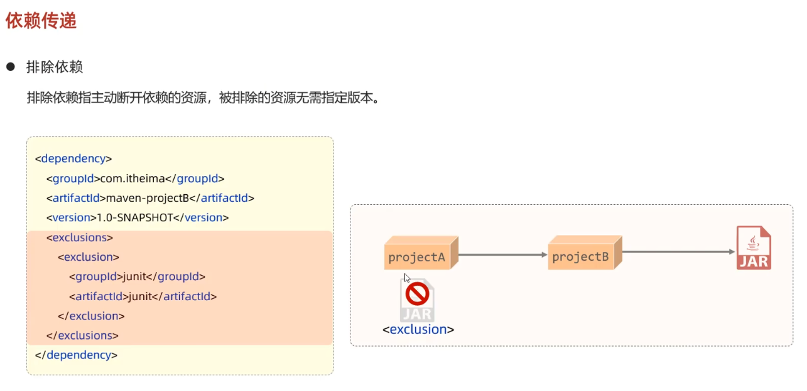

## Maven介绍

* 基本介绍

  1. maven是apache旗下的一个开源项目 是一款用于管理和构建jiava项目的工具
  2. maven的本质是一个插件执行框架
  3. apache公司是一个开源公司

* 作用

  1. 依赖管理

     **导入jar包较方便 并且自动解决依赖关系 不会起冲突**   在maven项目工程pom.xml配置文件中配置依赖信息 Maven会自动联网下载  然后就就可以在项目中直接使用 (同样可以对依赖进行升级 不会产生冲突)

     

  2. 统一项目结构

     不同开发软件创建的java项目工程项目目录结构不同   使用Maven创建的工程可以在不同软件中使用

     

  3. 标准化项目构建流程

     可以通过Maven工程的指令进行编译 测试 打包 等 进行方便的项目构建  并且具有跨平台性

     

## Maven概述 

* 介绍

  

  Maven

  

* 安装

  

## IDEA集成Maven

* 配置Maven环境

  1. 配置当前工程

     

  2. 配置当前工程

     

* 创建Maven项目

  1. 空项目中创建模块

     

  2. Maven坐标

     

  

* 导入Maven项目

  1. 通过加号点击pom文件添加maven项目

     

  2. 通过import添加Maven项目

     

  

## 依赖管理

* 依赖配置

  依赖仓库官网 https://mvnrepository.com/

  1. 介绍

     

* 依赖传递

  1. 介绍

     依赖具有传递性

     

     可以通过<exclussions> 排除(多个)依赖

     

* 依赖范围

  1. 介绍

     可以通过<scope> 来控制依赖范围

     

* 生命周期

  1. 介绍

     Maven三套独立的生命周期 clean default site

     

     生命周期中5个较为重要的阶段  同一套生命周期中 运行后面阶段时会运行前面的阶段

     

     5个重要阶段详细介绍

     

     执行指定生命周期的两种方式

     

     maven生命周期实际上是抽象的概念  并不执行具体的操作  它的具体操作是由与其绑定的maven插件来完成的的  maven的本质就是一个插件执行框架 所有的工作都是由插件完成的

