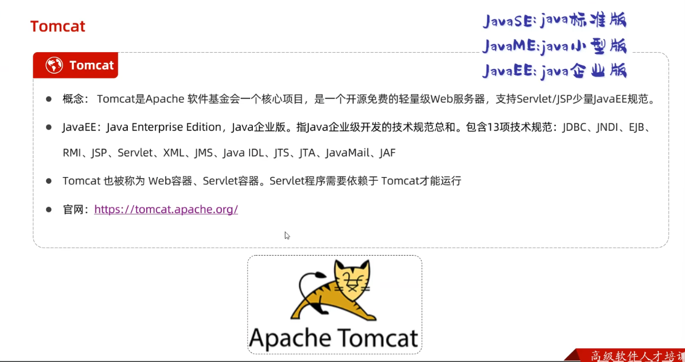
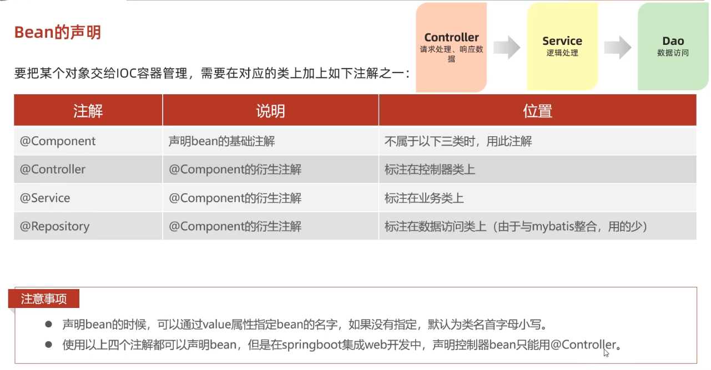

## SpringBoot基础介绍

* Spring  及 SpringBoot 介绍

  1. 基本介绍 Spring框架

     

  2. 基本介绍 SpringBoot

     所有Spring子项目都是基于 SpringFramework开发的 但SpringFramework 配置繁琐并且入门开发难度大 就开发了SpringBoot来简化配置以实现快速开发

     

## SpringBootWeb入门

* 内容

  

* 步骤

  

  请求处理类

  

## HTTP协议

* HTTP概述

  1. 基本介绍

     

* HTTP请求协议

  1. 请求行

     包含请求方式 资源路径 协议

  2. 请求头

     有以下几种请求key 以及代表的意思

     

  3. 请求体

     post请求特有的请求体(请求参数)  get请求内容直接以  url ? 请求参数& ... 附带到请求行的资源路径里了  get的请求大小是有限制的

  4. 总

     

* HTTP响应协议

  1. 响应行

     包含协议 状态码 描述

     状态码对应的表示如下

     

     常见的详细状态码含义

     | 状态码  | 英文描述                              | 解释                                                         |
     | ------- | ------------------------------------- | ------------------------------------------------------------ |
     | ==200== | **`OK`**                              | 客户端请求成功，即**处理成功**，这是我们最想看到的状态码     |
     | 302     | **`Found`**                           | 指示所请求的资源已移动到由`Location`响应头给定的 URL，浏览器会自动重新访问到这个页面 |
     | 304     | **`Not Modified`**                    | 告诉客户端，你请求的资源至上次取得后，服务端并未更改，你直接用你本地缓存吧。隐式重定向 |
     | 400     | **`Bad Request`**                     | 客户端请求有**语法错误**，不能被服务器所理解                 |
     | 403     | **`Forbidden`**                       | 服务器收到请求，但是**拒绝提供服务**，比如：没有权限访问相关资源 |
     | ==404== | **`Not Found`**                       | **请求资源不存在**，一般是URL输入有误，或者网站资源被删除了  |
     | 405     | **`Method Not Allowed`**              | 请求方式有误，比如应该用GET请求方式的资源，用了POST          |
     | 428     | **`Precondition Required`**           | **服务器要求有条件的请求**，告诉客户端要想访问该资源，必须携带特定的请求头 |
     | 429     | **`Too Many Requests`**               | 指示用户在给定时间内发送了**太多请求**（“限速”），配合 Retry-After(多长时间后可以请求)响应头一起使用 |
     | 431     | **`Request Header Fields Too Large`** | **请求头太大**，服务器不愿意处理请求，因为它的头部字段太大。请求可以在减少请求头域的大小后重新提交。 |
     | ==500== | **`Internal Server Error`**           | **服务器发生不可预期的错误**。服务器出异常了，赶紧看日志去吧 |
     | 503     | **`Service Unavailable`**             | **服务器尚未准备好处理请求**，服务器刚刚启动，还未初始化好   |

     状态码大全：https://cloud.tencent.com/developer/chapter/13553 

  2. 响应头

     

  3. 响应体(响应正文)

     最后一部分 存放响应数据 不在赘述

  4. 总

     

* HTTP协议解析

  1. 基本介绍

     

  2. 通过java Socket  SocketSever 来进行TCPIP编程 可以简单实现一个解析HTTP协议介绍请求 并且 响应数据的程序 具体步骤为 使用socket接收请求 接收到请求 开启线程 在线程中解析请求数据 通过socket通道得到输入流和输出流  接收请求并且返回数据  在浏览器中就可以进行访问得到数据 目前可以使用Web服务器进行解析

  

## Web服务器-Tomcat

* 服务器介绍

  nginx服务器的使用场景是分发服务(代理)  tomcat服务器的使用场景是服务器部署

  

* TomCat简介

  

* 基本使用

  下载 安装 卸载 启动 关闭

  

  端口占用可以手动更改

  

  TomCat项目部署

  将项目放置到webApps目录下  即部署完成

* 入门程序解析

  基于SpringBoot开发的项目生成的项目是固定模板的 ideal是基于start.spring.io 来下载项目和依赖到本地的 如果没有网络 也可以手动创建SpringBoot项目

  1. 解析1 起步依赖

     起步依赖是根据SpringBoot父工程的版本选择的  根据SpringBoot的依赖传递特性 只需引入一个依赖就可以引入所需特定功能的所有依赖

     

  2. 解析2 内嵌Tomcat服务器

     web起步依赖已经含有内嵌的Tomcat服务器  在SpringBoot 启动类启动时 就会自动启动该服务器默认占用8080端口 然后可以在浏览器中访问

     

## 请求响应

### 基本介绍

1. 基于SpringBoot框架开发的简单后端程序中TomCat负责HTML协议的解析 包括解析请求 响应数据  

2. TomCat也被称为Servle容器  其中DispactcherServlet类 实现了Severet接口  该类也被称为前端控制器 它能控制XXXController程序

3. DisPactcherServlet 类封装了相关的结束请求信息的类 HttpServleRequest类和响应数据的HttpServletResponse 类

4. 根据请求响应程序分布模式可以分为Bs架构 和 Cs架构

   

### 请求

* Postman

  1. 介绍

     Postman 是一款功能强大的网页调试与发送网页HTTP请求的Chrome插件  常用于进行接口测试

     注意:需要魔法

     

* 简单参数

  1. 原始参数获取请求参数 

     ```java
     	//请求控制类
         @RestController
     public class RequestController {
         //1. 通过HttpServletRequest获取参数
         @RequestMapping("/simpleParam")
         public String simpleParam(HttpServletRequest request) {
             String name = request.getParameter("name");
             String ageStr = request.getParameter("age");
             //返回值为字符串 需要类型转换
             int age = Integer.parseInt(ageStr);
             System.out.println(name +":" + age);
             return "OK";
         }
     }
     ```

  2. SpingBoot方式

     ```java
     //1. SpringBoot方式接收较简单  并且会进行自动类型转换
             @RequestMapping("/simpleParam")
         public String simpleParam(String name,Integer age) {
             System.out.println(name +":" + age);
             return "OK";
         }
     //2. 如果是post请求 Postman在请求体body中写入参数即可
     
     
     
     //3. 如果请求传入参数对应不上 则接收不成功(值为空)不会报错
     
     //4. 可以通过requestparam映射成别名从而接收  注意:Requestparam参数有一个默认参数 required = true 不传递就会报错 可以通过设置为false实现缺少参数不报错 @RequestParam(naem = "名",required = true)
     
       //以下通过Requestparam映射成别名从而接收 并且设置为缺少参数不报错
         @RequestMapping("/simpleParam") //控制方法
         public String simpleParam(@RequestParam(name="name",request=false) String nameStr, Integer age) {
             System.out.println(nameStr +":" + age);
             return "OK";
         }
     //理解： 应该是通过TomCat服务器进行HTML解析 HttpServleRequest类中封装的请求 前端控制器DispactcherServlet 通过一系列封装实现对controller包下的控制类中的控制方法的调用控制 从而实现通过控制类中的控制方法直接接收请求数据
     ```

  3. 小结

     

* 实体参数

  1. 介绍

     用一个对象封装较多的参数 请求参数名与形参属性对象名相同  定义pojo包来存放参数实体类 实体类中的属性会自动获取请求中的 参数 进行自动封装

  2. 简单实体参数

     通过url传递的参数中只有基本数据类型 没有对象 不需要二次封装

     ```java
      //实体参数接收
         @RequestMapping("/simpleParam")
         public String simpleParam(User user) {
             System.out.println(user.getName() +":" + user.getAge());
             return "OK";
         }
     
     //User类
     
     public class User {
         private String name;
         private Integer age;
     
         public String getName() {
             return name;
         }
     
         public void setName(String name) {
             this.name = name;
         }
     
         public Integer getAge() {
             return age;
         }
     
         public void setAge(Integer age) {
             this.age = age;
         }
     
         @Override
         public String toString() {
             return "User{" +
                     "name='" + name + '\'' +
                     ", age=" + age +
                     '}';
         }
     }
     ```

  3. 复杂实体参数

     通过url传递的参数中有对象 需要指定对象中的信息 以完成信息的自动封装

     ```java
     //复杂实体参数接收
         //对于User中的Address对象 浏览器传参时只关注信息 不关注对象 但需要声明是那个对象中的信息
         //如 address.province=河南&address.city=周口
         @RequestMapping("/simpleParam")
         public String simpleParam(User user) {
             System.out.println(user);
             return "OK";
         }
     
     //User类
     
     public class User {
         private String name;
         private Integer age;
         private Address address;
     
         public String getName() {
             return name;
         }
     
         public void setName(String name) {
             this.name = name;
         }
     
         public Integer getAge() {
             return age;
         }
     
         public void setAge(Integer age) {
             this.age = age;
         }
     
         public Address getAddress() {
             return address;
         }
     
         public void setAddress(Address address) {
             this.address = address;
         }
     
         @Override
         public String toString() {
             return "User{" +
                     "name='" + name + '\'' +
                     ", age=" + age +
                     ", address=" + address +
                     '}';
         }
     }
     
     //Address类
     
     public class Address {
         private String province;
         private String city;
     
         public String getProvince() {
             return province;
         }
     
         public void setProvince(String province) {
             this.province = province;
         }
     
         public String getCity() {
             return city;
         }
     
         public void setCity(String city) {
             this.city = city;
         }
     
         @Override
         public String toString() {
             return "Address{" +
                     "province='" + province + '\'' +
                     ", city='" + city + '\'' +
                     '}';
         }
     }
     ```

     

* 数组集合参数

  1. 介绍

     前端发送请求数据时可能有多个请求参数名相同的情况 如表单中的复选框 这时传参请求可以相同  请求参数名与形参数组名称相同并且请求参数为多个  可以定义数组类型(集合)形参即可接收参数

  2. 代码

     ```java
     //数组参数
     @RequestMapping("/arrayParam")
         public String arrayParam(String[] hobby) {
             System.out.println(Arrays.toString(hobby));
             return "OK";
         }
     
     //集合参数
     //可以通过RequestParam注解来绑定参数关键 从而实现传递给集合
     @RequestMapping("/arrayParam")
         public String arrayParam(@RequestParam List<String> hobby) {
             System.out.println(hobby);
             return "OK";
         }
     ```

* 日期参数

  1. 介绍

     前端传递参数为日期 可以使用LocalDateTime将时间进行封装 但需要用@DateTimeFormat 注解完成日期参数格式规定转换

  2. 代码

     ```java
     //日期参数  
     @RequestMapping("dateParam")
         public String dateParam(@DateTimeFormat(pattern = "yyyy-MM-dd HH:mm:ss") LocalDateTime localDateTime) {
             System.out.println(localDateTime);
             return "OK";
         }
     ```

* Json参数

  1. 介绍

     使用非常多 json数据请求需要使用post请求方式  放在请求体中传递

     json参数的接收 一般使用实体对象来接收 Json数据键名与形参对象属性名相同 定义pojo类型形参可接收参数 需要使用@RequestBody标识 来完成json格式的数据自动转换成对象

  2. 代码

     ```json
     //json格式数据
     {
         "name":"张三",
         "age":23,
         "address:{
             "province":"河南",
             "city":"周口"
         }
     }
     ```

     

     ```java
     //json格式成参数
     @RequestMapping("jsonParam")
     //将json格式的数据封装到对象中
         public String jsonParam(@RequestBody User user) {
             System.out.println(user);
             return "OK";
         }
     ```

* 路径参数

  1. 介绍

     通过URL直接传递参数 参数已经成为了url的一部分 如 http://localhost:8080/path/100   使用{...}来标识GIA路径参数  需要使用@PathVariabl获取路径参数 表示该参数接收路径参数中的值

  2. 代码

     ```java
        
     //1. 单路径参数
     
     //{id} 表示后半部分作为路径参数 是可变的 获取id后@PathVariable绑定的相同名的形参id上
         @RequestMapping("path/{id}")
         public String pathParam(@PathVariable Integer id) {
             System.out.println(id);
             return "OK";
         } 
     //2. 多路径参数 
     
     //可以使用/{}/{...}/..来接收传递的多个路径参数 注意每个路径参数都需要通过@PPathVariable注解绑定形参
         @RequestMapping("path/{id}/{name}")
         public String pathParam(@PathVariable Integer id,@PathVariable String name) {
             System.out.println(id +":" + name);
             return "OK";
         }
     
     ```

* 总结

  

### 响应

* 基本介绍

  1. 介绍

     使用@ResponseBody声明相应数据 一般在控制类上使用组合注解 RestController表名该类中的所有方法返回值为相应数据

     > @ResponseBody 注解表示控制类返回值自动转换成json数据 @RequsetBody注解 表示控制类接收参数自动转换成对象

     

  2. 注意

     如果返回值为对象 响应数据会转换成json格式的对象响应  一个对象封装成一个以  {}   所引起的json对象 如果对象是数组 并且中包含对象 如有两个对象的list集合的数组  响应的json对象是以一个数组包含两个对象的格式 [ { } ，{ } ] 

     **注意：**json格式的数据有以下几种字符 

     1.  [ ]  用于包含一个json对象的数组
     2.  { }  用于包含一个json对象中的键值信息
     3.  " "  用于引起一个json对象中的一个键 或者一个字符串值
     4.  ， 用于分开json对象的键值对 或者 json对象 亦或者json对象数组
     5. 总的来说json格式数据只有json对象数组和json对象 

  3. tip:

     controller包中的controller控制类中的所有方法都被称为功能接口  功能结构上@RequestMapping注解中包含的路径 为该功能接口的响应路径  开发文档中规定的就是功能结构的响应数据是什么 返回响应数据是什么

* 统一响应结果

  返回格式各种各样 不利于前端使用和项目管理维护 可以用一个Result对象封装所有数据

  

  代码

  ```java
  //result对象 
  public class Result {
      private Integer code ;//1 成功 , 0 失败
      private String msg; //提示信息
      private Object data; //数据 data
  
      public Result() {
      }
      public Result(Integer code, String msg, Object data) {
          this.code = code;
          this.msg = msg;
          this.data = data;
      }
      public Integer getCode() {
          return code;
      }
      public void setCode(Integer code) {
          this.code = code;
      }
      public String getMsg() {
          return msg;
      }
      public void setMsg(String msg) {
          this.msg = msg;
      }
      public Object getData() {
          return data;
      }
      public void setData(Object data) {
          this.data = data;
      }
  
      public static Result success(Object data){
          return new Result(1, "success", data);
      }
      public static Result success(){
          return new Result(1, "success", null);
      }
      public static Result error(String msg){
          return new Result(0, msg, null);
      }
  
      @Override
      public String toString() {
          return "Result{" +
                  "code=" + code +
                  ", msg='" + msg + '\'' +
                  ", data=" + data +
                  '}';
      }
  }
  ```

* 请求响应案例

  

  1. 解析XML文件需要dom4j的jar包 用于解析xml文件

  2. 一般解析xml文件还使用一个XmlParserUtils工具类用于简化解析的步骤  同时应有一个实体类(bean) 这里Emp

  3. 然后就可以解析xml文件了

  4. sprigBoot中的静态页面代码应方在resources的static包下

  5. 最后编写Controller程序处理请求响应数据

  6. SpringBoot项目的静态资源(Html css js等前端资源) 默认存放目录为 classpath:/static(推荐) 、classpath:/public、classpath:/resources

  7. 响应控制类代码

     ```java
     @RestController
     public class EmpController {
         @RequestMapping("/listEmp")
         public Result list() {
             //1. 加载并解析xml文件
             //基于classLouder或取资源路径 应该是获取类加载器 这个项目下的资源进行检索找到 返回文件路径
             String file = this.getClass().getClassLoader().getResource("emp.xml").getFile();
             List<Emp> empList = XmlParserUtils.parse(file, Emp.class);
             //2. 对数据进行转换处理
             empList.stream().forEach(emp -> {
                 String gender = emp.getGender();
                 if ("1".equals(gender)) {
                     emp.setGender("男");
                 } else {
                     emp.setGender("女");
                 }
                 String job = emp.getJob();
                 if ("1".equals(job)) {
                     emp.setJob("讲师");
                 } else if ("2".equals(job)) {
                     emp.setJob("班主任");
                 } else {
                     emp.setJob("就业指导");
                 }
             });
             //3. 响应数据
             return Result.success(empList);
         }
     }
     ```

### 分层解耦

* 介绍

  将代码逻辑都写入collector控制程序复用性不高 并且项目难以维护 这时就要引入分层解耦

* 三层架构

  编码结构分为三层  分别为:

  1. 接收请求 响应数据  Controller层

  2. 逻辑处理 Service层

  3. 数据访问 Data Access Object层 (持久层) 

     mybatis框架中也称为mapper层

     

  4. 代码  面向接口编程 

     

  

* 分层解耦

  1. 内聚： 软件中各个功能模块内部的功能连续 高内聚就是一个模块只完成一件事 不去参与其他无关的处理 (专一)

  2. 耦合： 衡量软件中各个层/模块之间的依赖、关联的程度 低耦合就是各个模块之间尽量减少依赖或者不存在依赖 (独立) 

     > **单一职责原则** 
     >
     > 它遵循高内聚 低耦合
     >
     > 高内聚 低耦合也是软件设计的原则
     >
     > 单一职责原则要求一个类或模块只负责一项职责或功能。它应该只有一个原因引起变化，这样当需求变化时，只需要修改与该职责相关的代码，而不会对其他职责造成影响。这种分离的设计使得代码更加灵活、可测试和易于理解。

  3. 使用(IOC/Spring)容器进行解耦

     --  使用控制反转和依赖注入

     

*  IOC & DI 入门

  1. 使用@Component注解实现控制反转

     想要交给容器的管理的类上加上@Component 表示将当前类交给IOC容器管理 成为IOB容器中的Bean

  2. 使用Autowired 注解实现依赖注入  

     将需要赋值的对象引用上加上@Autowired 表示运行时 IOC容器会自动提供该引用类型的(实现类)对象 赋值给该变量

  3. 

  4. 需要更改逻辑业务时只需要更换Component注解的类 来实现更改交给容器的对象 就会调用不同的方法 从而更改业务

* IOC详解

  * 衍生Component注解

    1. 被放入Sping/IOC容器中的类被称为Bean 使用注解有以下几种

    2. RestController注解 标注的响应控制类已经是容器中的一个类了 其中包含@Controller 注解 所以响应控制类也交给了IOC容器

    3. @Repository  和  @Service 和 @Controller 注解都是@Component 的衍生注解

    4. 每一个bean都有自己的名字 默认为类名首字母小写 可以用@Component(value="daoA")来指定bean类名 (values可以不写)

       

  * Bean组件扫描

    1. @Component注解生效条件为组件扫描到对应的类

    2. @SpringBootApplication注解中包含组件扫描注解@ComponentScan 其修饰的启动类中启动后会自动扫描启动类所在包及其子包 若bean类未在其中 就会报错

       

* DI详解

  1. 当有多个相同类型的bean时依赖注入会报错 有以下几种方式解决

     1. @AutoWired  + @Primary 在想要注入的bean类上添加该注解  该注解由Spring框架提供 （适用于相同类的不同实现 只需要一种指定的实现类对象）

     2. @AutoWired  + @Qualifie("bean名字") 在需要注入的变量上添加该注解  该注解由Spring框架提供 (和下同 根据对象名注入)

     3. @Resource("bean名字")  直接在需要注入的变量上只添加该注解 根据名字注入 该注解由JDK提供  (和上同 根据对象名注入)

        > spring框架下依赖注入Autowired是按类型注入  jdk下@resource 是按名称注入

        

     4. Autowired和Resource注解的区别

        
     
      