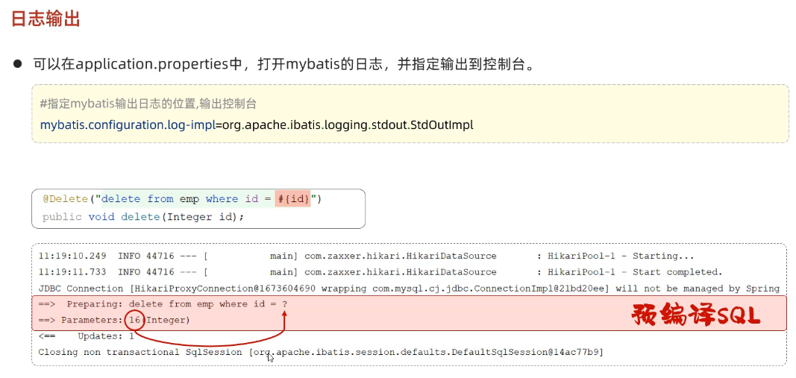
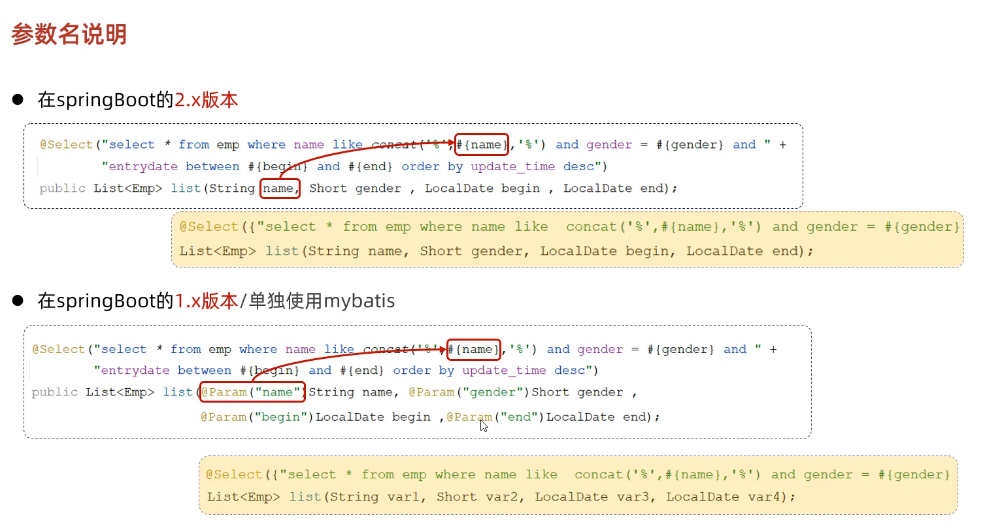

### 基本介绍

MyBatis是一款优秀的持久层框架(与数据库相关联获取数据用的) 用于简化JDBC的开发


大多数企业开发项目都是由SpringBoot框架搭建的项目下使用Mybatis

### Mybatis 入门

* 快速入门

  1. 使用Mybatis查询所有用户数据

     

  2. 总结

     使用Mybatis基本操作

     1. 构建SpringBoot项目引入**MySql驱动依赖**和**Mybatis框架依赖**

     2. 在resorces包下的application配置文件(后使用yam文件)中添加Mybatis通过Mysql驱动连接数据库的信息

     3. 根据要从数据库中获取的数据在pojo包中添加实体类对象

     4. 在mapper(映射)包中添加数据库操作的接口并在上添加@Mapper注解 表示在运行时 会自动生成该接口的实现类对象(代理对象)  并且将该对象交给IOC容器 ---- 等同于实现接口后在使用@Repository注解标识

     5. 在接口中定义抽象方法 并在上添加需要执行的SQL语句@Select("语句")  通过依赖注入的方式调用该方法就会执行对数据库执行Sql语句 返回的数据以该方法的返回值类型返回(如果有返回值的话)

     6. Mapper包就是三层架构中的dao层(持久层)  并且定义 的接口不用实现(实现的就是sql语句 逻辑一致 已经进行封装) 就可以自动生成对象交给ioc

     7. mapper包下 接口代码

        ```java
        @Mapper
        public interface UserMapper {
            @Select("select * from user")
            public List<User> list();
        }
        ```

     8. application.properties配置文件

        ```properties
        #驱动类名称
        spring.datasource.driver-class-name=com.mysql.cj.jdbc.Driver
        #数据库连接的url
        spring.datasource.url=jdbc:mysql://localhost:3306/mybatis
        #连接数据库的用户名
        spring.datasource.username=root
        #连接数据库的密码
        spring.datasource.password=xing123456
        ```

     9. 测试启动类代码

        ```java
        @SpringBootTest
        class MybatisMyslqProject01ApplicationTests {
            @Autowired
            private UserMapper userMapper;
        
            @Test
            void testUserMapper() {
                List<User> list = userMapper.list();
                list.stream().forEach(user -> {
                    System.out.println(user);
                });
            }
        }
        ```

        

  3. Sql提示

     在mapper包的接口中使用@Select("Sql")编写sql语句实现操作数据库或获取数据时 默认没提示 容易出错 可以用以下方法设置提示 

     

* JDBC介绍

  详情见java基础

* 数据库连接池

  详情见java基础

  SpringBoot默认使用Hikari(追光者)连接池

  Mybatis封装了JDBC和连接池技术(好像有自己的连接池技术?)  很方便

  1. SpringBoot中如何切换数据库连接池

     1. 引入连接池起步依赖

        ```xml
        <!--德鲁伊连接池-->
                <dependency>
                    <groupId>com.alibaba</groupId>
                    <artifactId>druid-spring-boot-starter</artifactId>
                    <version>1.2.8</version>
                </dependency>
            </dependencies>
        ```

     2. 更改application配置信息

        ```properties
        #驱动类名称
        spring.datasource.druid.driver-class-name=com.mysql.cj.jdbc.Driver
        #数据库连接的url
        spring.datasource.druid.url=jdbc:mysql://localhost:3306/mybatis
        #连接数据库的用户名
        spring.datasource.druid.username=root
        #连接数据库的密码
        spring.datasource.druid.password=xing123456
        
        //引入德鲁伊连接池依赖后  不更改也行
        ```

* lombok

  pojo包中实体类编写属性后 需要很多的get set方法 以及构造器 toString等 代码看上去较为臃肿 这时可以使用lombok这项技术来实现简化 （使用一个注解）

  ```xml
  //引入lombok的依赖后可以使用以下注解
  
  <dependency>
      <groupId>org.projectlombok</groupId>
      <artifactId>lombok</artifactId>
  <版本号根据父工程决定>
  </dependency>
  
  @Getter/@Setter  
  @ToString
  @EqualsAndHashCode
      
      下面常用
      
  @Data (相当于上面四个注解)
  @NoArgsConstructor  为实体类生成无参构造方法
  @AllArgsConstructor  为实体类生成除staic修饰成员变量外的构造方法
      
      
      
  原理: 根据注解在编译时决定生成怎么样的方法
  ```

  总
  
  

### Mybatis 基础增删改查(通过注解实现)

> 通过mybatis对员工表的crud

* 准备

  

  注意 pojo中的属性遵循小驼峰命名

* 删除

  1. mapper接口方法

     ```java
     @Mapper
     public interface EmpMapper {
         //1. 通过Mybatis 编写的sql语句中的#{}  为参数占位符  用于注解(xml)sql语句中
         // 注意: 如果mapper接口中的方法只有一个返回值  #{}中的可以任意写 因为只有一个参数 否则占位符中的参数名要与形参名一致
         @Delete("delete from emp where id = #{id}")
         //2. delete 和 insert update都有返回值 返回值为操作影响的记录数  用int类型作为返回值可以获取
         public void delete(Integer id);
     }
     ```

  2. 启动类测试方法

     ```java
     @SpringBootTest
     class MybatisMysqlCrudProject02ApplicationTests {
         @Autowired
         private EmpMapper empMapper;
     
         @Test
         void contextLoads() {
             empMapper.delete(17);
         }
     }
     ```

  3. tip: 日志输出

     ```properties
     #配置mybatis的日志 指定输出到控制台
     mybatis.configuration.log-impl=org.apache.ibatis.logging.stdout.StdOutImpl
     ```

     使用#{} 占位符是 预编译sql语句 性能更高 更安全(防止SQL注入)

     

     性能更高

     

     更安全 (防止SQL注入  ' or  '1' = '1) 

     > select count(*) from where name = '张三'  and  password = ' **' or '1' =1**';  无论如何都为真

  4. 参数占位符 (面试题)

     

* 插入

  1. mapper接口方法

     ```java
     @Mapper
     public interface EmpMapper {
         //1. 使用对象传参 mybatis会自动或取该对象中的属性名 和占位符中的对应符号自动比对填充
         //2. 注意属性名使用小驼峰命名法
         @Insert("insert into emp(username,name, gender, image, job, entrydate, dept_id, create_time, update_time)" +
                 " values(#{username},#{name},#{gender},#{image},#{job},#{entrydate},#{deptId},#{createTime},#{updateTime})")
         public void insert(Emp emp);
     }
     ```

  2. 启动类测试方法

     ```java
      @Test
         void insert() {
             Emp emp = new Emp();
             emp.setUsername("Tom");
             emp.setName("汤姆");
             emp.setGender((short)1);
             emp.setImage("1.jpg");
             emp.setJob((short)1);
             emp.setEntrydate(LocalDate.of(2020,2,3));
             emp.setDeptId(1);
             emp.setCreateTime(LocalDateTime.now());
             emp.setUpdateTime(LocalDateTime.now());
             empMapper.insert(emp);
         }
     ```

  3. 主键返回

     在数据添加成功后 需要获取插入数据库数据的主键 

     如：添加套餐数据时 或需要维护套餐菜品关系表数据

     在mapper接口插入方法上添加注解 @Opitons()实现主键返回 (根据已有数据进行数据库插入 然后查询得到主键 封装到已有数据对象的字段中)

     1. mapper接口方法

        ```java
            //1. useGeneratedKeys = true 表示开启主键返回 keyProperty = "id"表示将主键的值封装到用于插入数据的对象的字段id中
            @Options(keyProperty = "id",useGeneratedKeys = true)
            @Insert("insert into emp(username,name, gender, image, job, entrydate, dept_id, create_time, update_time)" +
                    " values(#{username},#{name},#{gender},#{image},#{job},#{entrydate},#{deptId},#{createTime},#{updateTime})")
            public void insert(Emp emp);
        ```

     2. 测试方法

        ```java
            @Test
            void insert() {
                Emp emp = new Emp();
                emp.setUsername("Tom");
                emp.setName("汤姆");
                emp.setGender((short)1);
                emp.setImage("1.jpg");
                emp.setJob((short)1);
                emp.setEntrydate(LocalDate.of(2020,2,3));
                emp.setDeptId(1);
                emp.setCreateTime(LocalDateTime.now());
                emp.setUpdateTime(LocalDateTime.now());
                empMapper.insert(emp);
                System.out.println(emp.getId());
            }
        tip:mysql primary key auto_increment主键自增长 无论是否插入 永远都会自增
        ```

* 更新

  1. mapper接口方法

     ```java
         //1. 同样使用emp对象封装数据
         @Update("update emp set username = #{username},name = #{name},gender = #{gender},image = #{image}," +
                 " job=#{job},entrydate=#{entrydate},dept_id=#{deptId},update_time=#{updateTime} where id = #{id}")
         public void update(Emp emp);
     ```

  2. 启动测试方法

     ```java
     @Test
         void update() {
             Emp emp = new Emp();
             emp.setId(18);
             emp.setUsername("Tom1");
             emp.setName("汤姆1");
             emp.setImage("1.jpg");
             emp.setGender((short)1);
             emp.setJob((short)1);
             emp.setEntrydate(LocalDate.of(2000,1,1));
             emp.setUpdateTime(LocalDateTime.now());
             emp.setDeptId(1);
             empMapper.update(emp);
         }
     ```

* 查询

  1. mapper接口方法

     ```java
         @Select("select * from emp where id = #{id}")
         public Emp select(int id);
     ```

  2. 启动测试方法

     ```java
         @Test
         public void select() {
             Emp emp = empMapper.select(18);
             System.out.println(emp);
         }
     ```

  3. 数据封装

     > 如果实体类属性名 和 数据库表查询返回的字段名一致  mybatis会自动封装
     >
     > 如果实体类属性名 和 数据库表查询返回的字段名不一致 不能自动封装
     >
     > 解决不同名不能自动封装的问题的方法如下：
     >
     > 1. 给字段名起别名 让别名与实体类属性名一致 (使用as 或者 直接起)
     >
     >    ```java
     >        @Select("select username,password,name,gender,id,job,entrydate,dept_id as deptID,create_time createTime,update_time updateTime from emp where id = #{id}")
     >        public Emp select(int id);
     >    ```
     >
     > 2. 通过@Results @Result注解手动映射  ----- @Results() 中为@Result()注解 集合数组
     >
     >    ```java
     >        @Results({
     >                @Result(column = "dept_id",property = "deptId"),
     >                @Result(column = "create_time",property = "createTime"),
     >                @Result(column = "update_time",property = "updateTime")
     >        })
     >        @Select("select * from emp where id = #{id}")
     >        public Emp select(int id);
     >    ```
     >
     > 3. 开启mybatis的驼峰命名自动映射开关 --- 开启后mysql中下划线命名的字段名会自动映射到java实体类中小驼峰命名的属性名上 在application.properties文件中设置 (推荐)
     >
     >    ```properties
     >    #开启mybatis的驼峰命名自动映射开关
     >    mybatis.configuration.map-underscore-to-camel-case=true
     >    ```

* 多条件查询

  1. mapper接口方法

     ```java
     //1. ''字符串里不能使用#{}作为占位符 但可以用${}实现字符串拼接 但字符串拼接不安全 存在sql注入问题
     @Select("select * from emp where name like '%${name}%' and gender = #{gender} and" +
             " entrydate between #{begin} and #{end} " +
             " order by update_time desc ")
     // tip: java中的LocalDate等日期类与mysql中的Date日期类可以自动比较 不用加''作为为字符串比较  并且上面案例中可以自动封装 
         public List<Emp> list(String name, Short gender, LocalDate begin,LocalDate end);
     
     //2. 可以使用concat()函数实现字符串拼接来使用占位符concat('%',#{name},'%') 提高安全性和性能
     @Select("select * from emp where name like concat('%',#{name},'%') and gender = #{gender} and" +
             " entrydate between #{begin} and #{end} " +
             " order by update_time desc ")
         public List<Emp> list(String name, Short gender, LocalDate begin,LocalDate end);
     ```

  2. 启动测试方法

     ```java
         @Test
         public void list() {
             List<Emp> emp = empMapper.list("张", (short) 1, LocalDate.of(2010, 1, 1), LocalDate.of(2020, 1, 1));
             System.out.println(emp);
         }
     ```

  3. 参数拓展知识

     springboot2中#{}占位符中使用的形参不用@Param声明 而是自动声明 可以直接使用  较方便
  
     

### Mybatis 基础增删改查(通过xml文件实现)

* 映射文件定义规范

  1. XML映射文件的名称与Mapper接口名称一致 并且XML映射文件和Mapper接口放在相同的包下(同包名)

     > tip:创建Directory目录时不能和包一样使用.分割实现多级目录结构 应用\分割
     >
     > xml配置文件应有约束 用于操作数据库的sql语句的xml映射文件的约束是固定的为下
     >
     > ```xml
     > <?xml version="1.0" encoding="UTF-8" ?>
     > <!DOCTYPE mapper
     >   PUBLIC "-//mybatis.org//DTD Mapper 3.0//EN"
     >   "http://mybatis.org/dtd/mybatis-3-mapper.dtd">
     > //以上为约束
     > <mapper namespace="org.mybatis.example.BlogMapper">
     >   <select id="selectBlog" resultType="Blog">
     >     select * from Blog where id = #{id}
     >   </select>
     > </mapper>
     > ```

  2. XMl映射文件namespace属性和Mapper接口的全限定名一致

     > ```xml
     > <?xml version="1.0" encoding="UTF-8" ?>
     > <!DOCTYPE mapper
     >   PUBLIC "-//mybatis.org//DTD Mapper 3.0//EN"
     >   "http://mybatis.org/dtd/mybatis-3-mapper.dtd">
     > 以下全限定名一致
     > <mapper namespace="com.ithema.mapper.EmpMapper">
     > 
     > </mapper>
     > ```
     >
     > 

  3. XML映射文件中sql语句的id与Mapper接口中的方法名一致 并且返回类型一致

     >```xml
     ><?xml version="1.0" encoding="UTF-8" ?>
     ><!DOCTYPE mapper
     >        PUBLIC "-//mybatis.org//DTD Mapper 3.0//EN"
     >        "http://mybatis.org/dtd/mybatis-3-mapper.dtd">
     >
     ><mapper namespace="com.ithema.mapper.EmpMapper">
     >    <!--id 为mapper接口方法名  resultType指的是单条记录封装的类型 其为全限定类名-->
     >    <select id="list" resultType="com.ithema.pojo.Emp">
     >        select *
     >        from emp
     >        where name like concat('%', #{name}, '%')
     >          and gender = #{gender}
     >          and entrydate between #{begin} and #{end}
     >        order by update_time desc
     >    </select>
     ></mapper>
     >```
     >
     >

  4. 总

     

  5. MybatisX插件 提高效率

     

  6. 选择 XMl 和 注解

     如果是简单的crudSQL语句  使用注解即可 

     如果sql语句较为复杂  推荐使用xml来配置映射语句

### Mybatis 动态SQL

* 基本介绍

  1. 随着用户的输入或外部条件变化而变化的SQL语句，这称为动态SQL
  
* <if>

  1. 判断条件是否成立 成立拼接 不成立不拼接

  2. mapper接口方法

     ```java
     //Mybatis下使用XML映射文件来操作数据库
         public List<Emp> list(String name, Short gender, LocalDate begin, LocalDate end);
     ```

  3. XMLsql映射文件

     ```xml
     <?xml version="1.0" encoding="UTF-8" ?>
     <!DOCTYPE mapper
             PUBLIC "-//mybatis.org//DTD Mapper 3.0//EN"
             "http://mybatis.org/dtd/mybatis-3-mapper.dtd">
     
     <mapper namespace="com.ithema.mapper.EmpMapper">
         <!--id 为mapper接口方法名  resultType指的是单条记录封装的类型 为其全限定类名-->
         <select id="list" resultType="com.ithema.pojo.Emp">
             select *
             from emp
             where
             -- test属性用于指定条件
             <if test="name!=null">
                 name like concat('%', #{name}, '%')
             </if>
     
             <if test="gender!=null">
                 and gender = #{gender}
             </if>
     
             <if test="begin!=null and end!=null">
                 and entrydate between #{begin} and #{end}
             </if>
             order by update_time desc
         </select>
     </mapper>
     ```

  4. 测试类方法

     ```java
         //动态sql
         @Test
         public void list() {
             List<Emp> emp = empMapper.list("张", (short) 1, null, null);
             System.out.println(emp);
         }
     ```

* <where> <set>

  1. <where>用于sql语句中的条件判断 标签中嵌套<if>标签包含的条件 

  2. 如果有条件成立 自动加上where 无条件 则不加

  3. where标签会自动去除字句开头(额外的)的and或 or 达到自动生成合适的正确语法的sql语句的效果

  4. 使用where标签的 XMLsql映射文件

     ```xml
     <?xml version="1.0" encoding="UTF-8" ?>
     <!DOCTYPE mapper
             PUBLIC "-//mybatis.org//DTD Mapper 3.0//EN"
             "http://mybatis.org/dtd/mybatis-3-mapper.dtd">
     
     <mapper namespace="com.ithema.mapper.EmpMapper">
         <!--id 为mapper接口方法名  resultType指的是单条记录封装的类型 为其全限定类名-->
         <select id="list" resultType="com.ithema.pojo.Emp">
             select *
             from emp
             <where>
                 -- test属性用于指定条件
                 <if test="name!=null">
                     name like concat('%', #{name}, '%')
                 </if>
     
                 <if test="gender!=null">
                     and gender = #{gender}
                 </if>
     
                 <if test="begin!=null and end!=null">
                     and entrydate between #{begin} and #{end}
                 </if>
                 order by update_time desc
             </where>
         </select>
     </mapper>
     ```

  5. <set>标签用于sql语句中设置属性 标签中嵌套<if>标签包含的条件 

  6. set标签中的语句理论上至少有一个成立 不然不会执行？

  7. set标签会自动去除语句尾(额外的)的逗号 达到自动生成合适的正确语法的sql语句的效果

  8. 使用set标签的 XMLsql映射文件

     ```xml
     <?xml version="1.0" encoding="UTF-8" ?>
     <!DOCTYPE mapper
             PUBLIC "-//mybatis.org//DTD Mapper 3.0//EN"
             "http://mybatis.org/dtd/mybatis-3-mapper.dtd">
     
     <mapper namespace="com.ithema.mapper.EmpMapper">
         <!--id 为mapper接口方法名-->
         <update id="update">
             update emp
             <set>
                 <if test="username!=null">username = #{username},</if>
                 <if test="name!=null">name = #{name},</if>
                 <if test="gender!=null">gender = #{gender},</if>
                 <if test="image!=null">image = #{image} ,</if>
                 <if test="job!=null">job=#{job},</if>
                 <if test="entrydate!=null">entrydate=#{entrydate},</if>
                 <if test="deptId!=null">dept_id=#{deptId},</if>
                 <if test="updateTime!=null">update_time=#{updateTime}</if>
                 where id = #{id}
             </set>
         </update>
     </mapper>
     ```

* <foreach>

  1. 用于循环遍历集合元素 并对元素进行操作 然后进行拼接 得到sql语句

  2. mapper接口方法

     ```java
     //批量通过id删除员工    
     public void deleteByIds(List<Integer> ids);
     ```

     

  3. 使用foreach的xmlsql映射文件

     ```xml
     <?xml version="1.0" encoding="UTF-8" ?>
     <!DOCTYPE mapper
             PUBLIC "-//mybatis.org//DTD Mapper 3.0//EN"
             "http://mybatis.org/dtd/mybatis-3-mapper.dtd">
     
     <mapper namespace="com.ithema.mapper.EmpMapper">
         <!--id 为mapper接口方法名  resultType指的是单条记录封装的类型 为其全限定类名-->
     
         <delete id="deleteByIds">
             -- collection:遍历的集合
             -- item:遍历出来的元素
             -- separator:分隔符
             -- open:遍历开始前拼接的Sql片段
             -- colse:遍历结束后拼接的Sql片段
             delete from emp where id in
             <foreach collection="ids" item="id" separator="," open="(" close=")">
                 #{id}
             </foreach>
         </delete>
     </mapper>
     ```

  4. 测试方法

     ```java
     //批量通过id删除员工   
     @Test
         public void deleteByIds() {
             empMapper.deleteByIds(Arrays.asList(1,2,3));
         }
     ```

     

* <sql> and <include>

  1. 他们配套使用 

  2. slq用于抽取sql片段 用id标识 

  3. include用于引用 用refid对应引用片段的标识

  4. sql和include提高sql代码的复用性

  5. 使用sql 和 include标签来简化xmlsql映射文件

     ```xml
     <mapper namespace="com.ithema.mapper.EmpMapper">
     
         <sql id="comment">select name
                           from emp</sql>
         <select id="list1">
             <include refid="comment"> //这里等于引用了select name from emp
                 
             </include>
         </select>
         
     </mapper>
     ```

     