## 事物管理 & AOP

### 事物管理

* 事物

  1. 事物是一组操作的集合 它是一个不可再分的工作单位 这些操作要么同时成功 要么同时失败

     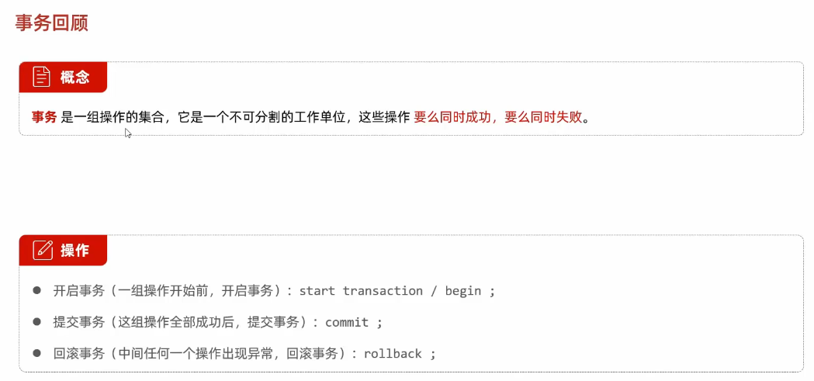

* Spring事物管理

  1. 介绍

     @Transactional 可以作用在类上 也可以作用在方法上 也可以作用在接口上

     > 作用在接口上表示 该接口的实现类中的所有方法交给spring进行事物管理 
     >
     > 作用在类上表示该类中的所有方法交给spring进行事物管理 
     >
     > 作用在方法上表示该方法交给spring进行事物管理 
     >
     > 开启事物的方法具有事物的一致性 如果执行过程中出现异常 则会进行回滚 防止数据被错误篡改

     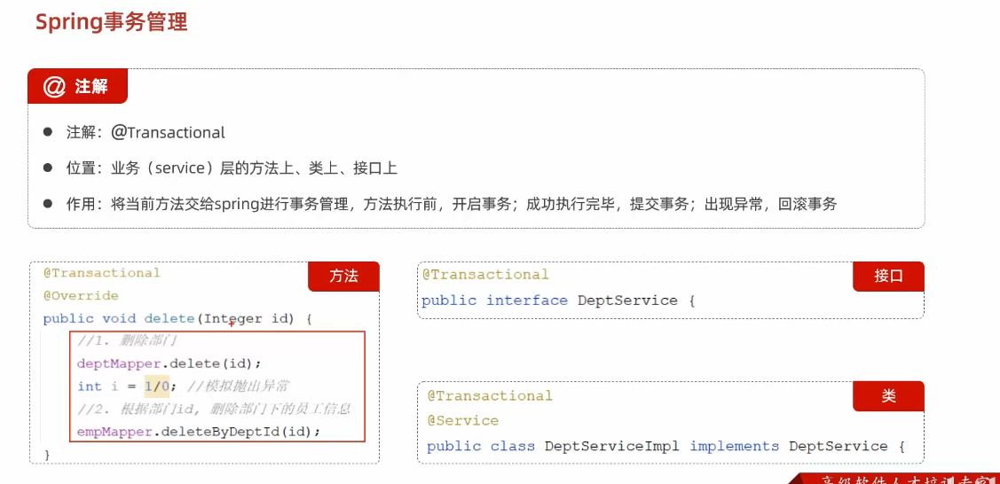

  2. 事物管理开关

     ```yaml
     #spring事务管理日志  显示事物开启和结束 日志
     logging:
       level:
         org.springframework.jdbc.support.JdbcTransactionManager: debug
     ```

  3. 例子

     ```java
     @Transactional //事物该方法开启事物
         @Override
         public void delete(Integer deptId) {
     
             deptMapper.delete(deptId); //删除部门信息
     
             empMapper.deleteByDeptId(deptId); //删除员工信息
         }
     ```

     

* 事务进阶

  1. rollbackFor 指定那些异常才会进事物回滚

     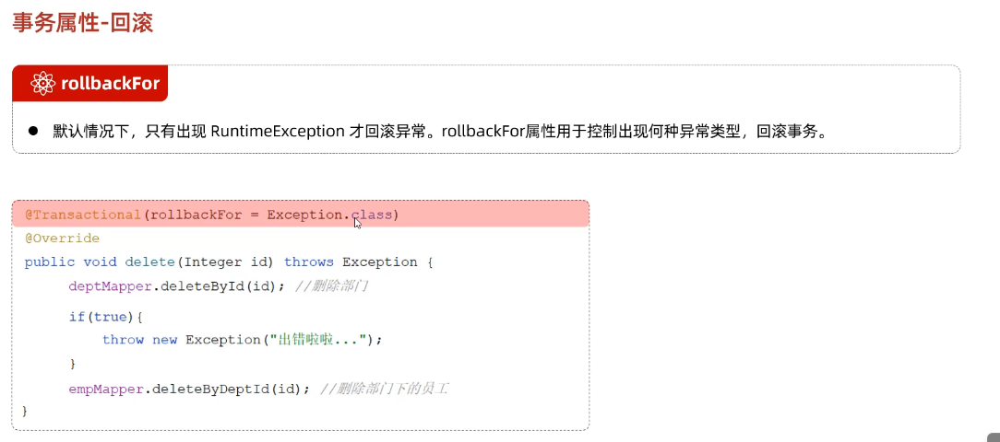

  2. propagation

     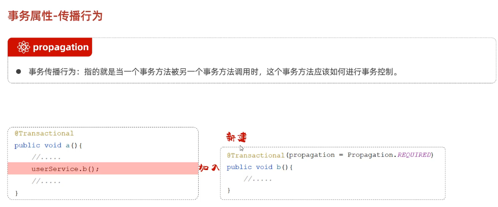

     常见的事物传播行为

     主要作用就是决定 在事物嵌套事物时决定是否开启新事物 发生错误是否回滚

     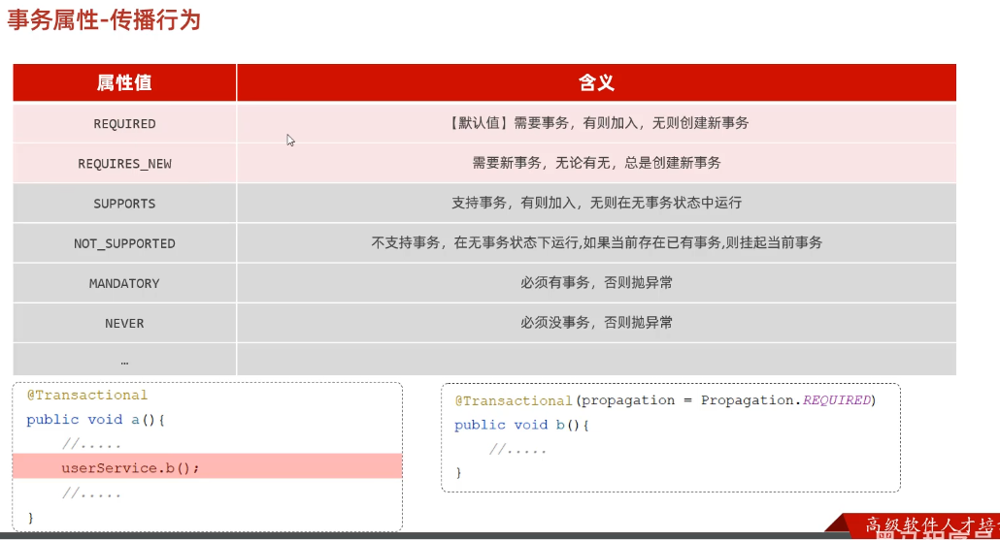

     常用场景

     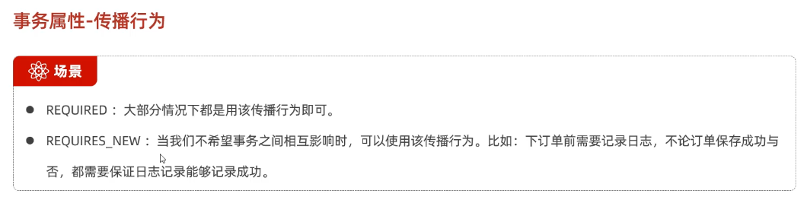

### AOP基础

* AOP 概述

  1. 基础介绍 -- AOP -- 动态代理

     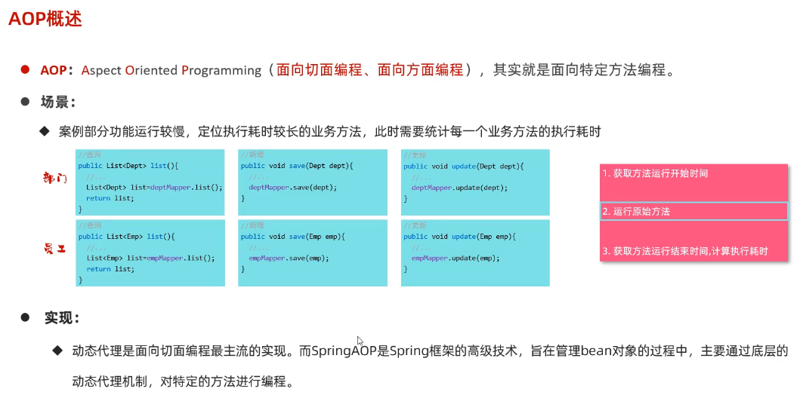

* AOP快速入门

  1. 思路 

     使用@Aspect注解标注AOP类

     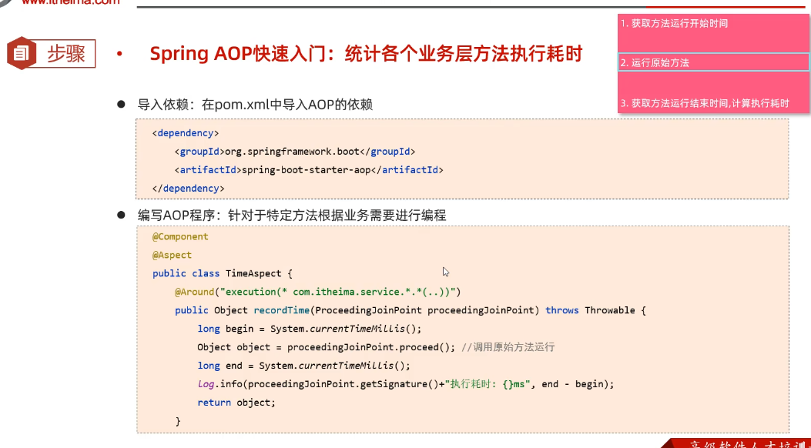

  2. AOP起步依赖

     ```xml
             <!--        AOP起步依赖-->
             <dependency>
                 <groupId>org.springframework.boot</groupId>
                 <artifactId>spring-boot-starter-aop</artifactId>
             </dependency>
     ```

  3. AOP实现检测每个接口方法执行时间

     ```java
     @Slf4j
     @Aspect  //标注为AOP类
     @Component  //交给IOC容器
     public class TimeAspect {
         @Around("execution(* com.itheima.service.*.*(..))") //切入点表达式 指定那些方法运行以下公共的逻辑代码
         public Object recordTime(ProceedingJoinPoint joinPoint) throws Throwable {
             //1. 记录开始时间
             long begin = System.currentTimeMillis();
             //2. 调用原始方法运行
             Object result = joinPoint.proceed();
             //3. 记录结束时间 计算执行耗时
     
             long end = System.currentTimeMillis();
             log.info(joinPoint.getSignature() + "方法执行耗时{} ms",end - begin);
             return result;
         }
     }
     
     //类似于装饰器 python中的闭包
     ```

  4. AOP作用

     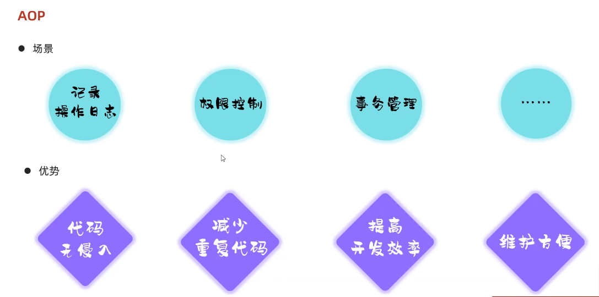

* AOP核心概念

  1. 连接点  通知  切入点 切面 目标对象 

     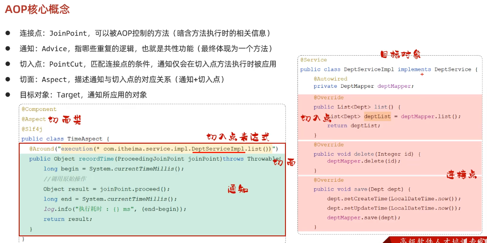

  2. 执行流程

     为目标对象生成代理对象 然后代理对象重写方法 对目标对象方法增加功能 注入时注入代理对象 

     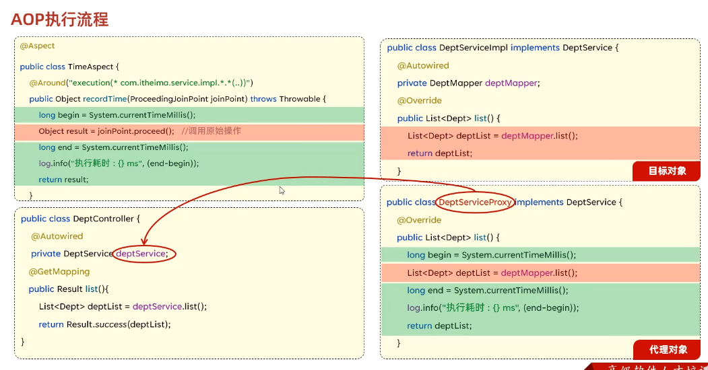

### AOP进阶

* 通知类型

  1. 五种通知类型

     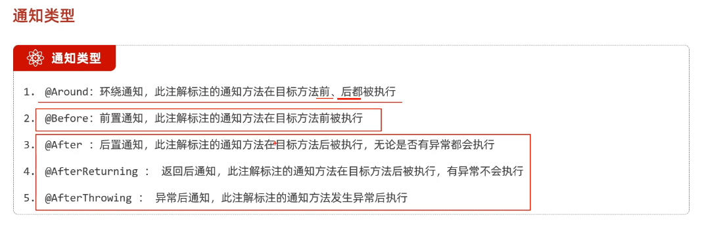

  2. tip 1

     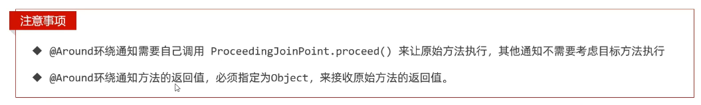

  3. tip 2

     可以使用@Pointcut("execution()") 抽取切入点表达式 之后就可以直接引用

     ```java
     @Slf4j
     @Component
     @Aspect
     public class MyAspect() {
         @Pointcut("execution(* itheima.service.impl.DeptServiceImpl.*(..))")
         private void pt() {}
         //定义在方法上 定义该切入点表达式 pt() 就代表  execution(* itheima.service.impl.DeptServiceImpl.*(..))
         
         //直接使用  不仅可以在当前切面类中使用 也可以在其他切面类中使用 只不过访问控制符要改为 public
         @Around("pt()")
         public void after() {
             ...
         }
     }
     
     可以根据该特征定义一个切入点表达式类
     ```

     

* 通知顺序 

  1. 不同的AOP类 其中切面的切入点匹配到了相同的目标方法 执行顺序和类名字母排序有关

  2. 可以使用@Order(数字) 注解 加到切面类上控制通知执行顺序

     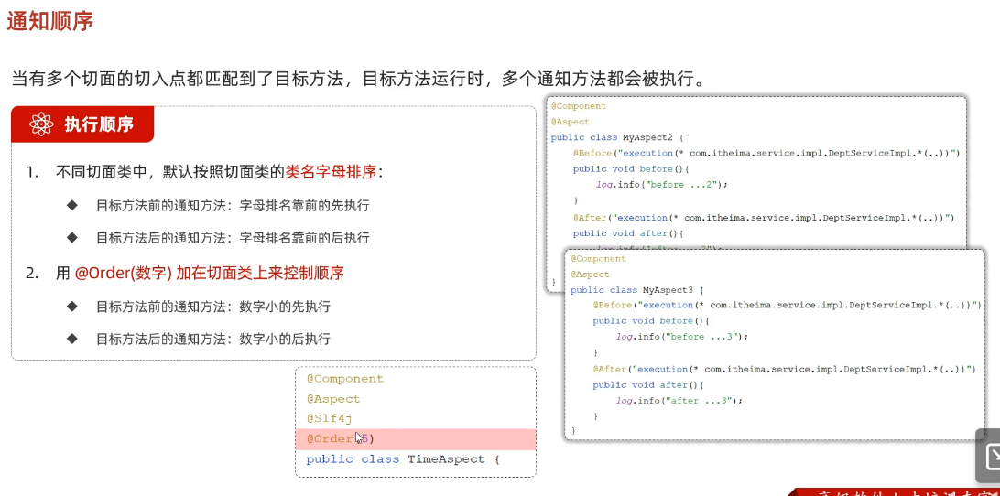

* 切入点表达式

  1. execution切入点表达式

     注意:可以匹配接口中的方法 -- 具体到实现的方法

     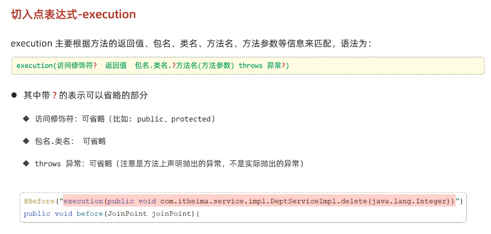

     通配符号  *可以表示以xxx开头 以xxx结尾  ..表示任意符号 

     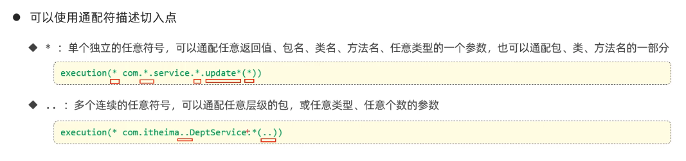

     ps: 匹配的都是满足条件的方法  根据业务需要 可以使用   &&   ||   !  来组合比较复杂的切入点表达式

     书写建议

  2. @Annotation根据注解的切入点表达式 @annotation(注解全类名)

     > 注意 这里 com.itheima.anno.Log 是一个注解 注解也是接口 所以有全类名  这里是通过自定义注解 被自定义注解标识的就是切入点方法 算是比较方便

     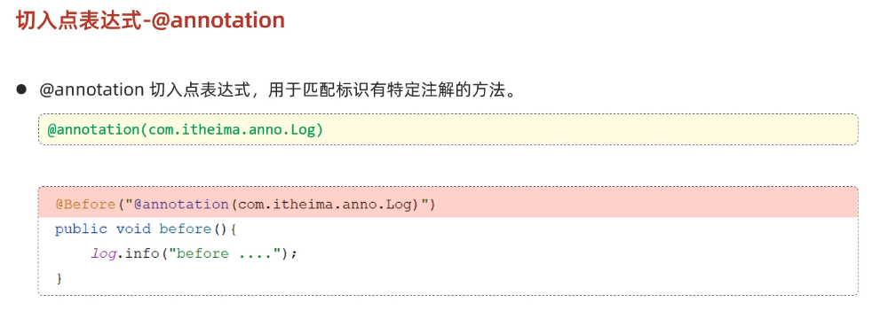

* 连接点

  1. 获取连接点相关信息

     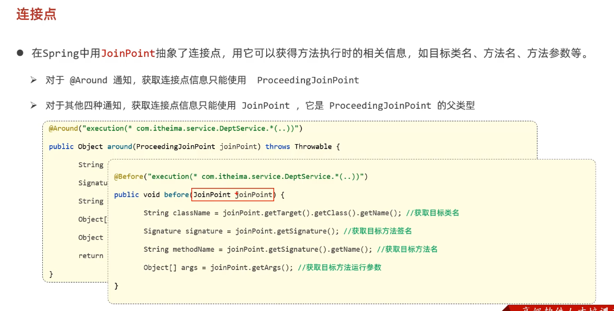

  2. 在通知中获取连接点相关信息的方法

     ```java
     @Slf4j
     @Component
     @Aspect
     public class MyAspect {
         @Before("execution(* com.itheima.service.*.*(..))")
         public void before(JoinPoint joinPoint) {
             System.out.println("before");
         }
     
         @Around("execution(* com.itheima.service.*.*(..))")
         public Object around(ProceedingJoinPoint joinPoint) throws Throwable {
             //1. 获取目标对象的类名
             String name = joinPoint.getTarget().getClass().getName();
             log.info("目标对象类名{}", name);
             //2. 获取目标方法的方法名
             String name1 = joinPoint.getSignature().getName();
             log.info("获取目标方法的方法名{}", name1);
             //3. 获取目标方法运行时传入参数
             Object[] args = joinPoint.getArgs();
             log.info("获取目标方法运行时传入参数{}", Arrays.toString(args));
     
             //4. 放行目标方法 后执行 获取返回值
             Object result = joinPoint.proceed();
             log.info("执行后获取返回值{}", result);
     
             return result;
         }
     }
     
     // tip: around通知方式下可以对切入点匹配的方法接口获取的数据进行篡改 因为动态代理对象是在接口方法前后加入逻辑 可以在通知中获取连接的的相关数据 包括返回值 (arround通知方式获取返回值然后返回相当于拦截了 -- 通过代理对象修改逻辑)
     ```

### AOP案例 

* 需求

  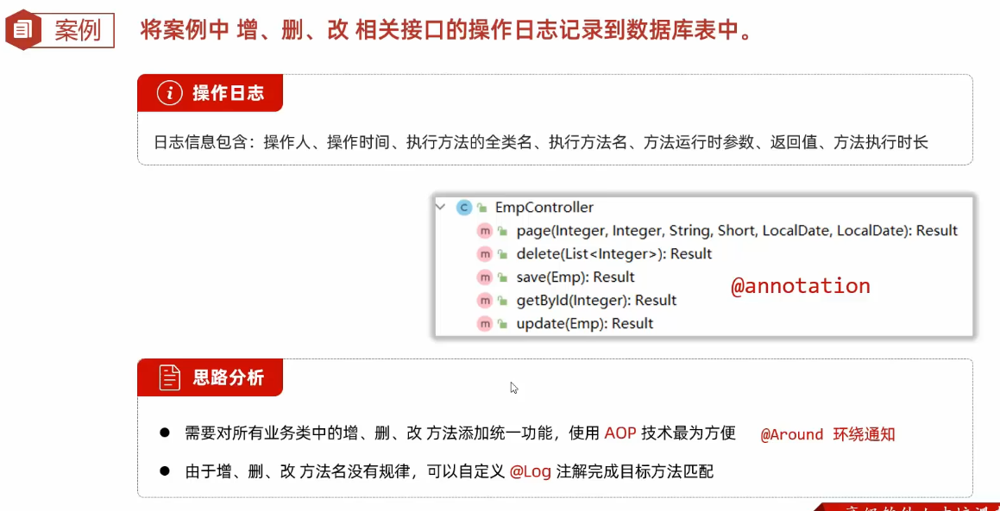

* 步骤

  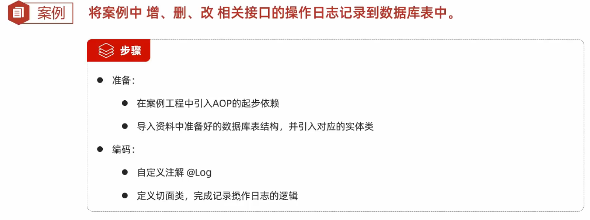

* 注意

  

* 详细步骤

  1. 数据库中建立数据库表用于存储操作日志(mysql操作)

  2. 定义对应的实体类 便于与数据包装与数据库插入操作

     ```java
     @Data
     @NoArgsConstructor
     @AllArgsConstructor
     public class OperateLog {}
     ```

  3. 定义数据接口Mapper 用于与数据库的连接和操作

     ```java
     @Mapper
     public interface OperateLogMapper {
         //插入日志数据
         @Insert("insert into operate_log (...)
         public void insert(OperateLog log);
     }
     ```

  4. 使用面向切面编程AOP 为特定的方法添加功能(思路)

  5. 定义标识注解 该注解用于切入点表达式匹配对应的可连接点的切入点 应用该注解的方法为切入点

     ```java
     @Retention(RetentionPolicy.RUNTIME) //运行时生效
     @Target(ElementType.METHOD) //用于方法上生效
     public @interface Log {
     }
     ```

  6. 定义切面类 其中定义一个切面通知方法为Around 因为要取得返回值

     ```java
     @Slf4j
     @Component
     @Aspect //切面类
     public class LogAspect {
         @Autowired
         private OperateLogMapper operateLogMapper;
         //可以自动注入 HttpServletRequest原本就是IOC容器中的对象
         @Autowired
         private HttpServletRequest request;
     
         @Around("@annotation(com.tlias.annno.Log)")
         public Object recordLod(ProceedingJoinPoint joinPoint) throws Throwable {
             //1. 人员id 
             String jwt = request.getHeader("token");
             // 这里注意 因为访问AOP时一定经过过滤器和 拦截器放行了 说明jwt令牌存在 并且可得到用户信息
             Map<String, Object> claims = JwtUtils.parseJWT(jwt);
             Integer operateUser = (Integer) claims.get("id");
             //2. 操作时间
             LocalDateTime operateTime = LocalDateTime.now();
             //3. 操作类名
             String className = joinPoint.getTarget().getClass().getName();
             //4. 获取方法名
             String methodName = joinPoint.getSignature().getName();
             //5. 获取参数
             String methodParams = Arrays.toString(joinPoint.getArgs());
     
             long start = System.currentTimeMillis();
             //6. 放行获取返回值  存入数据库的json格式的字符串
             Object result = joinPoint.proceed();
             String returnValue = JSONObject.toJSONString(result);
             long end = System.currentTimeMillis();
             long costTime = start - end;
             //7. 记录执行耗时
     
             //8. 插入日志对象
             OperateLog operateLog = new OperateLog(null, operateUser, operateTime, className, methodName, methodParams, returnValue, costTime);
             operateLogMapper.insert(operateLog);
     
             log.info("Aop记录日志{}",operateLog);
             return result;
         }
     }
     ```

     
  
  7. 通过依赖注入Mapper接口实现对象 和 HttpRequest对象 前者为了插入数据库数据 后者为了获取实体类中应封装的用户信息
     ```java
     //见上--6
     ```

  8. 实体类应封装的信息一部分可以通过切面中传入的ProceedingJoinPoint对象 或取对应切入点方法的信息
  
     ```java
     //见上--6
     ```

  9. 获取完信息后 封装到对象完 再调用Mapper中的方法插入数据库log数据
  
     ```java
     //见上--6
     ```
  
     

